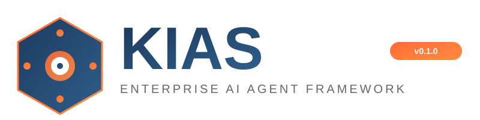
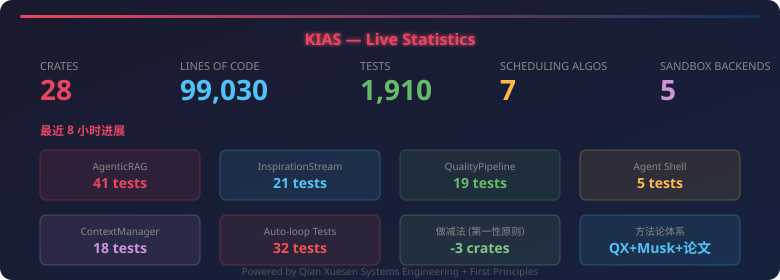

<p align="center">
  <a href="https://github.com/Andy-ckm/KIAS/blob/main/LICENSE">
    
  </a>
  <a href="https://github.com/Andy-ckm/KIAS/actions">
    
  </a>
  <a href="https://www.rust-lang.org">
    
  </a>
  <a href="https://github.com/Andy-ckm/KIAS">
    
  </a>
  <a href="https://github.com/Andy-ckm/KIAS">
    
  </a>
  <a href="https://github.com/Andy-ckm/KIAS">
    
  </a>
</p>

<p align="center">
  
</p>

<h1 align="center">KIAS</h1>
<p align="center"><strong>Kubernetes-like Intelligent Agent Scheduling</strong></p>
<p align="center">Production-grade AI Agent cluster orchestration built in Rust</p>

<p align="center">
  <a href="docs/technical-showcase.md">Technical Deep Dive</a> ·
  <a href="#quickstart">Quickstart</a> ·
  <a href="#architecture">Architecture</a> ·
  <a href="#supported-models">Supported Models</a> ·
  <a href="#system-requirements">System Requirements</a>
</p>

---

## Overview

KIAS is a Rust-based AI Agent cluster scheduling system that applies Kubernetes control-plane architecture to LLM agent orchestration. It addresses the gap between prototype agent scripts and production-ready agent infrastructure: state persistence, crash recovery, multi-agent coordination, cache-aware scheduling, sandboxed execution, and observability.

**Key numbers:**

<p align="center">
  
</p>

| Metric | Value |
|--------|-------|
| Rust Crates | 22 |
| Lines of Code | 85,000+ |
| Scheduling Algorithms | 7 (including GPU-Aware, Edge) |
| MCP Sandbox Backends | 5 (Docker / Firecracker / gVisor / Wasm / Process) |
| Test Coverage | `#[cfg(test)]` module in every crate |

---

## Architecture

```
┌─────────────────────────────────────────────────────────────────┐
│                         API Server (axum)                        │
│                   REST + gRPC + WebSocket + mTLS                 │
├─────────┬──────────┬──────────┬──────────┬───────────────────────┤
│Scheduler│Controller│Workflow  │  Team    │  Goal    │ Autonomy   │
│  Engine │          │  Engine  │  Engine  │  Engine  │ Controller │
│ 7 algos │Heartbeat │ DAG exec │ OVW      │ Goal loop│ 3-level    │
├─────────┴──────────┴──────────┴──────────┴──────────┴───────────┤
│  LangGraph Engine    │   MCP Protocol    │   Data Store (SQLite) │
│  State graph+FanOut  │   JSON-RPC+Sandbox│   Vector+Prefix Cache │
├──────────────────────┴───────────────────┴───────────────────────┤
│                    Common (L0): Error / Config / A2A / Masking    │
└─────────────────────────────────────────────────────────────────┘
```

**Layered dependency model** (enforced by `make lint-arch`):

```
L0: common                    ← Base types, errors, config
L1: data-store                ← SQLite persistence layer
L2: scheduler, controller, workflow-engine, team-engine, ...
L3: api-server, kias-main
```

Strict unidirectional dependencies. No cross-layer imports.

---

## Core Innovations

### 1. Cache-Aware Scheduling

**File:** [`crates/scheduler/src/algorithms/cache_aware.rs`](crates/scheduler/src/algorithms/cache_aware.rs)

Traditional schedulers (Round Robin, Least Loaded) are blind to LLM inference characteristics — they don't know whether a node has already cached a specific system prompt's KV Cache. A cache miss means recomputing the entire prefix, wasting ~90% of GPU compute.

KIAS introduces **DeepSeek-style Prefix Caching** into the scheduling decision layer:

```rust
// crates/scheduler/src/algorithms/cache_aware.rs
fn cache_aware_score(
    node: &Node, agent: &Agent,
    cache_info: Option<&NodeCacheInfo>, cache_weight: f64,
) -> f64 {
    let cache_score = if let (Some(info), Some(prefix_hash)) = (cache_info, agent.system_prompt_hash) {
        if info.cached_prefixes.contains(&prefix_hash) { 1.0 } else { 0.0 }
    } else { 0.0 };
    let load_score = 1.0 - node.load_factor();
    cache_weight * cache_score + (1.0 - cache_weight) * load_score
}
```

- **Fast path:** If a node has a matching cached prefix, route directly (score = 1.0)
- **Weighted scoring:** `cache_weight` parameter (0.0 = pure load balancing, 1.0 = pure cache priority)
- **Concurrent-safe:** `Arc<DashMap>` for lock-free concurrent cache map access

This is the only scheduling solution that incorporates LLM inference characteristics into scheduling decisions at the scheduler level.

---

### 2. LangGraph State Graph Engine

**File:** [`crates/langgraph-engine/src/graph.rs`](crates/langgraph-engine/src/graph.rs)

LLM workflows are not linear — they require conditional branching, loops, parallel subtasks, and interrupt-resume semantics. Existing DAG engines (Airflow, Temporal) are either too heavy or lack LLM-specific interrupt-resume support.

KIAS implements a complete LangGraph-style state graph engine with four edge types:

```rust
// crates/langgraph-engine/src/graph.rs
pub enum EdgeType {
    Direct { from: String, to: String },
    Conditional { from: String, to: String, condition: EdgeCondition },
    Router { from: String, router: RouterFn },
    FanOut { from: String, targets: Vec<String>, join_node: String },
}
```

**Parallel FanOut execution** spawns each branch in an independent `tokio::spawn` task, with state changes merged via last-write-wins strategy. **Checkpoint persistence** enables interrupt-resume semantics — `resume_from_checkpoint()` restores from the checkpoint node, not from the entry point.

Build-time validation via `build()` detects unreachable nodes and missing entry points before runtime. `max_steps` guard prevents infinite loops in LLM-driven conditional cycles.

---

### 3. TypedState — Compile-Time Safe Reducer Mechanism

**File:** [`crates/workflow-engine/src/typed_state.rs`](crates/workflow-engine/src/typed_state.rs)

LangGraph's core abstraction is the TypedDict + Reducer pattern. In Python, this relies on type hints (runtime checks). KIAS leverages Rust's type system to guarantee state merge correctness at compile time.

```rust
// crates/workflow-engine/src/typed_state.rs
pub trait ChannelReducer<T>: Send + Sync + 'static {
    fn reduce(&self, current: T, incoming: T) -> T;
    fn name(&self) -> &str;
}
```

Five built-in reducers: `Replace`, `Append`, `Merge` (shallow HashMap merge), `KeepFirst`, `Sum`. Each channel erases its type to `Box<dyn Any>` but captures the original type's reducer via closure. On `update()`, type safety is restored through `downcast`.

- **Compile-time safety:** Mismatched `T` and Reducer are rejected by the compiler
- **Runtime flexibility:** Channel names are strings, supporting dynamic registration
- **Concurrent branch safety:** FanOut branches merge state deterministically through reducers

---

### 4. Three-Layer Memory System

**File:** [`crates/team-engine/src/memory.rs`](crates/team-engine/src/memory.rs)

The core bottleneck in multi-agent collaboration is not communication — it's memory. Agents lose context after task completion, forcing redundant re-computation.

KIAS implements a three-layer memory architecture:

| Layer | Eviction Strategy | Purpose |
|-------|-------------------|---------|
| **ShortTerm** | TTL + LRU | Current task context |
| **LongTerm** | access_count + recency | Cross-task knowledge accumulation |
| **Entity** | confidence + recency | Entity attribute memory with confidence scores |

```rust
// crates/team-engine/src/memory.rs
pub struct MemoryManager {
    pub short_term: Arc<RwLock<ShortTermMemory>>,
    pub long_term: Arc<RwLock<LongTermMemory>>,
    pub entity: Arc<RwLock<EntityMemory>>,
}
```

`ContextBuilder` assembles context within a token budget (~4 chars/token heuristic), solving LLM context window overflow. All layers are thread-safe via `Arc<RwLock<>>` for concurrent multi-agent read/write. Entity Memory records confidence levels, allowing agents to distinguish between "known" and "inferred" facts.

---

### 5. Worker-Verifier Adversarial Quality Gate

**File:** [`crates/team-engine/src/verifier.rs`](crates/team-engine/src/verifier.rs)

Single-agent output quality is uncontrollable. Even with Chain of Thought, LLMs generate incorrect code, miss edge cases, and produce hallucinations.

KIAS implements an adversarial Worker-Verifier mechanism:

```rust
// crates/team-engine/src/verifier.rs
pub enum VerificationRule {
    Contains(String),
    NotContains(String),
    MinLength(usize),
    MaxLength(usize),
    ValidJson,
    Pattern(String),
    ShellCheck(String),  // Execute shell commands for verification
}
```

The `ShellCheck` rule runs actual test commands (e.g., `cargo test`, `python -m pytest`) during verification, elevating quality assurance from "looks correct" to "runs correctly." Verifier issues feed directly into the Worker's next iteration, forming a closed-loop improvement cycle.

---

### 6. Autonomy Gradient Controller

**File:** [`crates/autonomy-controller/src/autonomy.rs`](crates/autonomy-controller/src/autonomy.rs), [`crates/autonomy-controller/src/ladder.rs`](crates/autonomy-controller/src/ladder.rs)

Full autonomy is dangerous; full confirmation is inefficient. KIAS implements Codex CLI-style three-mode autonomy control with a complete decision pipeline:

```
Tool Policy Check → Rate Limit Check → Budget Check → Autonomy Level Judgment → Audit Log
```

```rust
// crates/autonomy-controller/src/ladder.rs
pub enum AutonomyLevel {
    Suggest,    // Suggest only, no execution
    AutoEdit,   // Write operations auto-execute, others require confirmation
    FullAuto,   // Fully automatic, constrained by tool policies
}
```

**Auto-promotion:** When an agent achieves consecutive successes above a threshold, it automatically promotes from `Suggest` to `AutoEdit`, reducing human intervention. `Forbidden` policy remains enforced even in `FullAuto` mode.

---

### 7. Goal-Driven Loop Engine

**File:** [`crates/goal-engine/src/loop_runner.rs`](crates/goal-engine/src/loop_runner.rs)

The "execute → evaluate → feedback → re-execute" pattern is ubiquitous in LLM applications. Most frameworks implement this as ad-hoc while loops in application code, lacking standardization, checkpoints, cancellation, and observability.

KIAS abstracts this as `GoalLoopRunner` with separated executor-evaluator roles:

```rust
// crates/goal-engine/src/loop_runner.rs
#[async_trait::async_trait]
pub trait RoundExecutor: Send + Sync {
    async fn execute_round(
        &self, goal: &Goal, round: u32,
        previous_feedback: Option<&EvaluationResult>,
    ) -> KiasResult<String>;
}
```

`GoalCancelToken` (based on `AtomicBool`) enables graceful external termination. `evaluation_history` tracks per-round evaluation results for convergence analysis. Checkpoint callbacks allow external systems to persist state after each round.

---

### 8. Descheduler — Cluster Rebalancing with PDB Constraints

**File:** [`crates/scheduler/src/descheduler/engine.rs`](crates/scheduler/src/descheduler/engine.rs)

Schedulers decide where to place work; they don't decide when to move it. Over time, clusters develop: underutilized nodes wasting resources, anti-affinity constraints violated, agent replicas concentrated on few nodes.

KIAS implements a K8s Descheduler-style engine with three built-in strategies:

| Strategy | File | Purpose |
|----------|------|---------|
| `LowNodeUtilization` | `strategies/low_utilization.rs` | Detect underutilized nodes, migrate agents |
| `DuplicateAgent` | `strategies/duplicates.rs` | Detect over-concentration of agent replicas |
| `AntiAffinityViolation` | `strategies/anti_affinity.rs` | Detect and repair anti-affinity violations |

**Pod Disruption Budget (PDB) constraints** ensure evictions don't cause service interruptions. Dry Run mode supports previewing eviction plans without execution.

---

### 9. A2A Protocol + MCP Sandbox

**Files:** [`crates/common/src/a2a.rs`](crates/common/src/a2a.rs), [`crates/mcp-protocol/src/sandbox.rs`](crates/mcp-protocol/src/sandbox.rs)

Agent interconnection requires standardized protocols; agent execution of external tools requires security isolation.

**A2A (Agent-to-Agent)** implements Google's A2A protocol with complete data models:

```rust
// crates/common/src/a2a.rs
pub struct AgentCard {
    pub id: String,
    pub capabilities: AgentCapabilities,
    pub skills: Vec<AgentSkill>,
    pub authentication: Option<AuthInfo>,
}
```

Task lifecycle follows A2A spec: `Submitted → Working → InputRequired → Completed/Failed/Cancelled/Rejected`. Agent handoff supports 6 reasons: `CapabilityGap`, `LoadBalancing`, `Specialization`, `ErrorRecovery`, `HumanDirected`, `CostOptimization`.

**MCP Sandbox** provides 5 isolation backends:

```rust
// crates/mcp-protocol/src/lib.rs
pub use sandbox::{
    FirecrackerSandboxBackend,  // Lightweight VM
    GVisorSandboxBackend,       // User-space kernel
    ProcessSandboxBackend,      // Process-level isolation
    WasmSandboxBackend,         // WebAssembly
    DockerSandboxBackend,       // Docker container
};
```

Sandbox snapshots support state restore with `IsolationLevel` (Session / User / Global). Full MCP implementation includes OAuth 2.0, RBAC, circuit breaker, rate limiter, credential management, and hot-reload.

---

### 10. Data Masking Framework

**File:** [`crates/common/src/data_mask.rs`](crates/common/src/data_mask.rs)

LLM system logs frequently leak sensitive data: IP addresses, email addresses, JWT tokens. Traditional post-hoc masking or logging framework plugins are error-prone.

KIAS implements **zero-trust masking** at the infrastructure layer:

```rust
// crates/common/src/data_mask.rs
pub fn redact_log_message(msg: &str) -> String {
    let mut result = msg.to_string();
    result = redact_emails(&result);
    result = redact_ips(&result);
    result = redact_tokens(&result);  // Tokens ≥ 32 chars
    result
}
```

`SensitiveData` wrapper automatically masks on `Display` and `Serialize` — original values are never leaked. IPv4 detection uses a hand-written deterministic state machine (not regex), eliminating ReDoS risk. Since masking lives in the L0 `common` crate, all upstream components inherit it automatically.

---

## Node-Level Error Handling

KIAS provides fault tolerance at every layer of the stack:

```
Request → Agent → Failure → DLQ → Exponential Backoff Retry → Circuit Breaker → Auto Recovery
```

| Mechanism | Implementation | File |
|-----------|---------------|------|
| Dead Letter Queue | Failed tasks queued for retry | `crates/controller/src/recovery.rs` |
| Circuit Breaker | Consecutive failures trigger open state | `crates/controller/src/health.rs` |
| Exponential Backoff | Configurable retry with jitter | `crates/controller/src/recovery.rs` |
| Health Check Loop | Continuous node liveness probing | `crates/controller/src/heartbeat.rs` |
| Saga Compensation | Workflow rollback on partial failure | `crates/workflow-engine/src/engine.rs` |

---

## Supported Models

### Cloud APIs

| Provider | Latest Model | Context | Input ($/1M tokens) | Output ($/1M tokens) |
|----------|-------------|---------|---------------------|---------------------|
| **OpenAI** | GPT-5.5 | 1,050K | $5.00 | $30.00 |
| **OpenAI** | GPT-5 | 400K | $1.25 | $10.00 |
| **OpenAI** | GPT-5-mini | 400K | $0.25 | $2.00 |
| **OpenAI** | o4-mini | 200K | $1.10 | $4.40 |
| **Anthropic** | Claude Opus 4.7 | 1,000K | $5.00 | $25.00 |
| **Anthropic** | Claude Sonnet 4.6 | 1,000K | $3.00 | $15.00 |
| **Anthropic** | Claude 3.5 Haiku | 200K | $0.80 | $4.00 |
| **Google** | Gemini 3.1 Pro | 1,048K | $2.00 | $12.00 |
| **Google** | Gemini 2.5 Pro | 1,048K | $1.25 | $10.00 |
| **Google** | Gemini 2.5 Flash | 1,048K | $0.30 | $2.50 |
| **DeepSeek** | DeepSeek-V4 Pro | 1,048K | $0.43 | $0.87 |
| **DeepSeek** | DeepSeek-V4 Flash | 1,048K | $0.11 | $0.22 |
| **DeepSeek** | DeepSeek-R1 | 163K | $0.70 | $2.50 |
| **Qwen** | Qwen3-Coder | 1,048K | $0.22 | $1.80 |
| **Qwen** | Qwen3-235B | 262K | $0.07 | $0.10 |
| **Mistral** | Mistral Large (2512) | 262K | $0.50 | $1.50 |
| **Mistral** | Codestral (2508) | 256K | $0.30 | $0.90 |
| **Meta** | Llama 4 Scout | 10,000K | $0.08 | $0.30 |
| **Meta** | Llama 4 Maverick | 1,048K | $0.15 | $0.60 |

> Pricing sourced from OpenRouter API (May 2026).

### Local Models

See [Local Model Comparison Guide](docs/local-model-comparison.md) for specifications, benchmarks, GPU requirements, and deployment recommendations across 16 open-source models.

| Runtime | Install | Use Case |
|---------|---------|----------|
| **Ollama** | `curl -fsSL https://ollama.com/install.sh \| sh` | Development & testing |
| **vLLM** | `pip install vllm` | Production high-throughput |
| **llama.cpp** | GitHub release | Edge devices, CPU inference |

---

## System Requirements

### Operating Systems

| Platform | Architecture | Status | Package |
|----------|-------------|--------|---------|
| **Ubuntu 22.04+** | x86_64 / aarch64 | ✅ Primary | `.deb` |
| **Debian 12+** | x86_64 / aarch64 | ✅ Supported | `.deb` |
| **CentOS 9 / RHEL 9** | x86_64 / aarch64 | ✅ Supported | `.rpm` |
| **Fedora 40+** | x86_64 / aarch64 | ✅ Supported | `.rpm` |
| **Alpine 3.18+** | x86_64 / aarch64 | ✅ Supported | Static binary |
| **macOS 13+** | Apple Silicon (M1-M4) / x86_64 | ✅ Supported | Homebrew |
| **Windows 11** | x86_64 | ⚠️ Via WSL2 only | `.msi` (WSL2) |
| **Docker** | x86_64 / aarch64 | ✅ Official image | `ghcr.io/andy-ckm/kias` |

### Hardware

| Component | Minimum | Recommended |
|-----------|---------|-------------|
| **CPU** | 2 cores | 4+ cores |
| **RAM** | 2 GB | 4+ GB |
| **Disk** | 500 MB (binary) | 2+ GB (with SQLite data) |
| **Network** | Outbound HTTPS | Required for LLM API calls |

> KIAS is a single binary (~30 MB). No runtime dependencies (no JVM, no Node, no Python).
> SQLite is embedded. No external database required for single-node deployment.

### Dependencies

| Dependency | Required | Notes |
|-----------|----------|-------|
| **Rust 1.85+** | Build only | Stable channel |
| **SQLite 3.35+** | Runtime (embedded) | Auto-included via `rusqlite` bundled feature |
| **OpenSSL / rustls** | Runtime | TLS for LLM API calls (rustls by default) |

### Deployment Modes

#### Ubuntu / Debian (`.deb`)

```bash
# Download and install
curl -LO https://github.com/Andy-ckm/KIAS/releases/latest/download/kias-amd64.deb
sudo dpkg -i kias-amd64.deb

# Start as systemd service
sudo systemctl enable --now kias
sudo systemctl status kias

# Logs
journalctl -u kias -f
```

#### CentOS / RHEL / Fedora (`.rpm`)

```bash
# Download and install
curl -LO https://github.com/Andy-ckm/KIAS/releases/latest/download/kias-x86_64.rpm
sudo rpm -i kias-x86_64.rpm

# Start as systemd service
sudo systemctl enable --now kias
sudo systemctl status kias
```

#### macOS (Homebrew)

```bash
# Install via Homebrew
brew tap andy-ckm/kias
brew install kias

# Start as launchd service (auto-start on login)
brew services start kias

# Or run manually
kias server start
```

#### Alpine / Static Binary

```bash
# Download static binary (no glibc dependency)
curl -LO https://github.com/Andy-ckm/KIAS/releases/latest/download/kias-linux-amd64-static
chmod +x kias-linux-amd64-static
sudo mv kias-linux-amd64-static /usr/local/bin/kias

# Run with OpenRC
sudo rc-service kias start
```

#### Docker

```bash
# Quick start
docker run -d \
  --name kias \
  -p 8080:8080 \
  -v kias-data:/data \
  -e KIAS_MODEL_PROVIDER=openai \
  -e KIAS_MODEL_API_KEY=sk-your-key \
  ghcr.io/andy-ckm/kias:latest

# Docker Compose
curl -LO https://raw.githubusercontent.com/Andy-ckm/KIAS/main/docker-compose.yml
docker compose up -d
```

#### Windows (WSL2)

```powershell
# 1. Enable WSL2
wsl --install -d Ubuntu-22.04

# 2. Inside WSL2, follow Ubuntu instructions above
wsl -d Ubuntu-22.04
curl -LO https://github.com/Andy-ckm/KIAS/releases/latest/download/kias-amd64.deb
sudo dpkg -i kias-amd64.deb
kias server start

# Access from Windows browser: http://localhost:8080
```

#### Kubernetes (Helm)

```bash
helm repo add kias https://charts.kias.dev
helm install kias kias/kias-operator \
  --namespace kias-system --create-namespace \
  --set model.provider=openai \
  --set model.apiKey=sk-your-key
```

#### Build from Source

```bash
git clone https://github.com/Andy-ckm/KIAS.git
cd KIAS
cargo build --release
./target/release/kias server start
```

---

## Quickstart

### Install

```bash
curl -fsSL https://raw.githubusercontent.com/Andy-ckm/KIAS/main/install.sh | sh
```

### Configure

```bash
kias config init
```

Edit `~/.kias/config.toml`:

```toml
[model]
provider = "openai"
api_key = "sk-your-key"
model = "gpt-5.5"

# Local model
# provider = "ollama"
# endpoint = "http://localhost:11434"
# model = "qwen3:32b"
```

### Start

```bash
kias server start
# Dashboard: http://localhost:8080
```

### Create an Agent

```yaml
# my-agent.yaml
name: my-agent
description: Code review assistant
model: gpt-5.5
system_prompt: You are a professional code review engineer.
```

```bash
kias agent create --file my-agent.yaml
kias agent invoke --name my-agent --text "Review this code"
```

---

## CLI Reference

```bash
# Agent management
kias agent list                            # List all agents
kias agent create --file agent.yaml        # Create agent
kias agent invoke --name my --text "hello" # Invoke agent
kias agent status --name my                # Check status

# Service management
kias server start                          # Start server
kias server start --daemon                 # Start in background
kias server stop                           # Stop server

# Development
make build                                 # Build all crates
make test                                  # Run tests
make lint                                  # Clippy checks
make lint-arch                             # Layer dependency check
make bench                                 # Criterion benchmarks
```

---

## Hardware Requirements

### KIAS Framework

| Profile | CPU | Memory | Disk |
|---------|-----|--------|------|
| Minimum (dev) | 2 cores | 4 GB | 10 GB |
| Recommended (prod) | 4+ cores | 8+ GB | 50+ GB SSD |

### Local Model GPU Requirements

| Model Size | VRAM | Example Models |
|-----------|------|---------------|
| 1B–3B | 3–6 GB | Phi-3-mini, Qwen3-8B |
| 7B–14B | 8–16 GB | Qwen3-14B, Llama 4 Scout (quantized) |
| 30B–40B | 24–40 GB | Qwen3-32B |
| 70B+ | 48–80 GB | Qwen3-235B (INT4) |

---

## Project Structure

```
kias/
├── crates/
│   ├── common/              # Shared types, errors, A2A protocol, data masking
│   ├── scheduler/           # 7 scheduling algorithms + descheduler
│   ├── controller/          # Agent lifecycle, heartbeat, recovery
│   ├── langgraph-engine/    # State graph engine (FanOut, checkpoints, interrupt-resume)
│   ├── workflow-engine/     # DAG workflow engine, TypedState reducers
│   ├── team-engine/         # Multi-agent orchestration, Worker-Verifier, memory
│   ├── goal-engine/         # Goal-driven loop runner
│   ├── autonomy-controller/ # 3-level autonomy control with auto-promotion
│   ├── mcp-protocol/        # MCP protocol + 5 sandbox backends
│   ├── model-router/        # Multi-provider model routing
│   ├── data-store/          # SQLite persistence, vector store, prefix cache
│   ├── api-server/          # REST + gRPC + WebSocket API
│   ├── executor/            # Task execution framework
│   ├── cache/               # LRU + prefix caching
│   ├── monitor/             # Telemetry + metrics collection
│   ├── knowledge/           # Knowledge graph
│   ├── skills/              # Skill registry
│   ├── kias-cli/            # Command-line tool
│   ├── kias-main/           # Main service orchestration
│   └── benchmarks/          # Criterion performance benchmarks
├── dashboard/               # React web console
├── config/                  # Configuration files
├── docs/                    # Documentation
└── scripts/                 # Build, startup, and check scripts
```

---

## Tech Stack

| Layer | Technology | Rationale |
|-------|-----------|-----------|
| Async Runtime | tokio | Rust async ecosystem standard |
| Web Framework | axum | Type-safe middleware system |
| Concurrent Map | DashMap | Lock-free, suited for high-frequency R/W |
| Serialization | serde | Zero-cost abstractions |
| Configuration | config crate | TOML/YAML/JSON + env var override |
| Logging | tracing | Structured logging with span support |
| Error Handling | thiserror + anyhow | Business errors via thiserror, internal via anyhow |

---

## Comparison

| Feature | KIAS | LangGraph (Python) | CrewAI | AutoGen |
|---------|------|--------------------|--------|---------|
| **Language** | Rust | Python | Python | Python |
| **State Persistence** | SQLite + Checkpoint | In-memory (needs external store) | None | None |
| **Error Recovery** | DLQ + Circuit Breaker + Saga | Limited | None | None |
| **Multi-tenancy** | Resource quotas + Sandbox | None | None | None |
| **Observability** | Prometheus + WebSocket | None built-in | None | None |
| **Cache-Aware Scheduling** | KV Cache hit-rate aware | None | None | None |
| **Autonomy Control** | 3-level gradient with auto-promotion | None | None | None |
| **Concurrency Model** | Tokio async (10K+ concurrent) | Single-threaded | Single-threaded | Single-threaded |
| **Sandbox** | 5 backends | None | None | None |

---

## Contributing

See [CONTRIBUTING.md](CONTRIBUTING.md).

1. Fork the repository
2. Create a feature branch (`git checkout -b feature/amazing`)
3. Run tests (`cargo test --workspace`)
4. Run architecture lint (`make lint-arch`)
5. Commit changes (`git commit -m 'Add amazing feature'`)
6. Push branch (`git push origin feature/amazing`)
7. Open a Pull Request

---

## License

Copyright © 2024 KIAS Contributors

Licensed under the **MIT License**. See [LICENSE](LICENSE) for details.
