# KIAS

**Enterprise-grade AI Agent framework in Rust.**

[](https://www.rust-lang.org/)
[]()
[]()

---

## What is KIAS?

KIAS is a **production-ready AI Agent framework** that lets you build, deploy, and manage AI agents that actually work in production — not just demos.

### The Problem

Most AI Agent frameworks are built for demos, not production:

- ❌ **Crash on restart** — Lose all state when process dies
- ❌ **No error handling** — One failure kills everything
- ❌ **No monitoring** — Can't see what's happening
- ❌ **No isolation** — All agents share resources, one bad agent affects others
- ❌ **Python performance** — High latency, high memory, can't scale
- ❌ **Vendor lock-in** — Only works with one LLM provider

### The KIAS Solution

KIAS fixes all of this with **enterprise-grade features** out of the box:

| Pain Point | KIAS Solution | Benefit |
|------------|---------------|---------|
| Crashes lose state | **Graceful Shutdown** + SQLite persistence | Zero data loss on restart |
| No error handling | **Dead Letter Queue** + **Circuit Breakers** | Auto-recovery from failures |
| No monitoring | **Prometheus Metrics** + **Health Checks** | Real-time visibility |
| No isolation | **Multi-tenant** with resource quotas | Safe multi-user deployment |
| Python slow | **Rust** with Tokio async | 10x faster, 10x less memory |
| Vendor lock-in | **Multi-provider** support | Switch LLMs without code changes |

---

## What Can KIAS Do?

### 🤖 Agent Management
- Define agents declaratively (YAML/JSON)
- Run agents with automatic retry and error handling
- Monitor agent health and performance in real-time

### ⚡ Workflow Orchestration
- Build complex workflows with DAG (directed acyclic graph)
- Parallel execution with dependency management
- Automatic rollback on failure

### 🔧 Tool Integration
- MCP (Model Context Protocol) support
- Custom tool registration
- Sandboxed code execution

### 📊 Observability
- Prometheus metrics out of the box
- Distributed tracing for request lifecycle
- Real-time WebSocket event streaming

### 🏢 Enterprise Features
- Multi-tenant isolation with resource quotas
- Audit logging for compliance
- API key rotation with smart failover

---

## Quick Start (5 minutes)

### Step 1: Install KIAS

**Option A: One-liner (Recommended)**
```bash
curl -fsSL https://raw.githubusercontent.com/Andy-ckm/KIAS/main/install.sh | sh
```

**Option B: Docker**
```bash
docker run -p 8080:8080 ghcr.io/Andy-ckm/kias:latest
```

**Option C: From Source**
```bash
# Prerequisites: Rust 1.95+
git clone https://github.com/Andy-ckm/KIAS
cd KIAS
cargo build --release
sudo cp target/release/kias-main /usr/local/bin/
```

### Step 2: Initialize Configuration

```bash
# Create config directory
mkdir -p ~/.kias

# Generate default config
kias config init

# Edit config (optional)
nano ~/.kias/config.toml
```

### Step 3: Configure LLM Provider

Edit `~/.kias/config.toml`:

```toml
[model]
# Option 1: OpenAI
provider = "openai"
api_key = "sk-your-key-here"
model = "gpt-4o"

# Option 2: Anthropic
# provider = "anthropic"
# api_key = "sk-ant-your-key-here"
# model = "claude-3-5-sonnet-20241022"

# Option 3: Local Ollama (free, no API key needed)
# provider = "ollama"
# endpoint = "http://localhost:11434"
# model = "llama3.1:8b"
```

### Step 4: Start KIAS

```bash
# Start in foreground (for testing)
kias server start

# Or start in background
kias server start --daemon
```

### Step 5: Verify Installation

```bash
# Check health
curl http://localhost:8080/healthz

# Open dashboard
open http://localhost:8080
```

---

## Installation Guide

### System Requirements

| Component | Minimum | Recommended |
|-----------|---------|-------------|
| CPU | 2 cores | 4+ cores |
| RAM | 4 GB | 8+ GB |
| Storage | 10 GB | 50+ GB |
| OS | Linux, macOS, Windows WSL2 | Ubuntu 22.04+ |

### For Local Model Inference

| Model Size | GPU VRAM | System RAM | Example Models |
|------------|----------|------------|----------------|
| 7B params | 8 GB | 16 GB | Llama 3.1 7B, Qwen 2.5 7B |
| 13B params | 16 GB | 32 GB | Llama 3.1 13B, CodeLlama 13B |
| 70B params | 48+ GB | 64+ GB | Llama 3.1 70B (quantized) |

### Detailed Installation Steps

#### Linux (Ubuntu/Debian)

```bash
# 1. Install dependencies
sudo apt update
sudo apt install -y curl wget

# 2. Install KIAS
curl -fsSL https://raw.githubusercontent.com/Andy-ckm/KIAS/main/install.sh | sh

# 3. Verify installation
kias --version

# 4. Initialize and start
kias config init
kias server start
```

#### macOS

```bash
# 1. Install via curl
curl -fsSL https://raw.githubusercontent.com/Andy-ckm/KIAS/main/install.sh | sh

# 2. Or install via Homebrew (coming soon)
# brew install kias

# 3. Initialize and start
kias config init
kias server start
```

#### Docker

```bash
# 1. Pull image
docker pull ghcr.io/Andy-ckm/kias:latest

# 2. Run container
docker run -d \
  --name kias \
  -p 8080:8080 \
  -v kias-data:/app/data \
  ghcr.io/Andy-ckm/kias:latest

# 3. Check status
docker logs kias
curl http://localhost:8080/healthz
```

#### Docker Compose (Full Stack)

```bash
# 1. Clone repo
git clone https://github.com/Andy-ckm/KIAS
cd KIAS

# 2. Start all services
docker-compose up -d

# 3. Check status
docker-compose ps
curl http://localhost:8080/healthz
```

---

## System Architecture

```mermaid
graph TB
    subgraph "Client Layer"
        CLI[CLI Tool<br/>kias-cli]
        Dashboard[Web Dashboard<br/>React + TypeScript]
        SDK[SDK<br/>Rust / Python / JS]
    end

    subgraph "API Gateway"
        API[API Server<br/>Axum + WebSocket]
        Auth[Auth & RBAC<br/>JWT / OAuth / API Key]
        RateLimit[Rate Limiter<br/>Per-tenant quotas]
    end

    subgraph "Core Engine"
        Controller[Controller<br/>Task orchestration]
        Scheduler[Scheduler<br/>Cron-based jobs]
        WorkflowEngine[Workflow Engine<br/>DAG execution]
        TeamEngine[Team Engine<br/>Multi-agent collab]
    end

    subgraph "Agent Runtime"
        Agent[Agent Runtime<br/>Sandboxed execution]
        Sandbox[Code Sandbox<br/>Docker / Wasm / nsjail]
        MCPProtocol[MCP Protocol<br/>Tool integration]
    end

    subgraph "Model Layer"
        ModelRouter[Model Router<br/>Load balancing]
        KeyRotation[Key Rotation<br/>Smart failover]
        CloudAPIs[Cloud APIs<br/>OpenAI / Anthropic / Google]
        LocalModels[Local Models<br/>Ollama / vLLM / llama.cpp]
    end

    subgraph "Data Layer"
        DataStore[(SQLite<br/>Agents, Tasks, Workflows)]
        VectorStore[(Vector DB<br/>HNSW embeddings)]
        Cache[(Cache<br/>In-memory)]
        AuditLog[(Audit Log<br/>Compliance)]
    end

    subgraph "Observability"
        Metrics[Prometheus<br/>Metrics]
        Tracing[Distributed Tracing<br/>Request lifecycle]
        HealthCheck[Health Checks<br/>Deep / Liveness]
        DLQ[Dead Letter Queue<br/>Failed tasks]
    end

    subgraph "Infrastructure"
        GracefulShutdown[Graceful Shutdown<br/>SIGTERM handling]
        CircuitBreaker[Circuit Breaker<br/>Auto-recovery]
        MultiTenant[Multi-tenant<br/>Isolation]
    end

    %% Client connections
    CLI --> API
    Dashboard --> API
    SDK --> API

    %% API Gateway
    API --> Auth
    API --> RateLimit
    Auth --> Controller

    %% Core Engine
    Controller --> Agent
    Controller --> Scheduler
    Controller --> WorkflowEngine
    Controller --> TeamEngine

    %% Agent Runtime
    Agent --> Sandbox
    Agent --> MCPProtocol
    Agent --> ModelRouter

    %% Model Layer
    ModelRouter --> KeyRotation
    ModelRouter --> CloudAPIs
    ModelRouter --> LocalModels

    %% Data Layer
    Controller --> DataStore
    Agent --> DataStore
    Controller --> VectorStore
    Controller --> Cache
    Controller --> AuditLog

    %% Observability
    Controller --> Metrics
    API --> Tracing
    HealthCheck --> Controller
    Controller --> DLQ

    %% Infrastructure
    Controller --> GracefulShutdown
    Controller --> CircuitBreaker
    Controller --> MultiTenant

    %% Styling
    classDef client fill:#e1f5fe,stroke:#01579b
    classDef api fill:#f3e5f5,stroke:#4a148c
    classDef core fill:#e8f5e8,stroke:#1b5e20
    classDef agent fill:#fff3e0,stroke:#e65100
    classDef model fill:#fce4ec,stroke:#880e4f
    classDef data fill:#f1f8e9,stroke:#33691e
    classDef observability fill:#e0f2f1,stroke:#004d40
    classDef infra fill:#f5f5f5,stroke:#424242

    class CLI,Dashboard,SDK client
    class API,Auth,RateLimit api
    class Controller,Scheduler,WorkflowEngine,TeamEngine core
    class Agent,Sandbox,MCPProtocol agent
    class ModelRouter,KeyRotation,CloudAPIs,LocalModels model
    class DataStore,VectorStore,Cache,AuditLog data
    class Metrics,Tracing,HealthCheck,DLQ observability
    class GracefulShutdown,CircuitBreaker,MultiTenant infra
```



---

## Model Support

KIAS supports **both cloud APIs and local models**:

### Cloud API Providers

| Provider | Models | Setup |
|----------|--------|-------|
| OpenAI | GPT-4o, GPT-4, GPT-3.5 | Set `OPENAI_API_KEY` |
| Anthropic | Claude 3.5 Sonnet, Claude 3 Opus | Set `ANTHROPIC_API_KEY` |
| Google | Gemini 1.5 Pro, Gemini 1.5 Flash | Set `GOOGLE_API_KEY` |
| Azure OpenAI | All OpenAI models | Set `AZURE_OPENAI_ENDPOINT` |
| AWS Bedrock | Claude, Llama, Mistral | Set `AWS_ACCESS_KEY_ID` |
| OpenRouter | 100+ models | Set `OPENROUTER_API_KEY` |

### Local Model Servers

| Server | Install | Start | Models |
|--------|---------|-------|--------|
| **Ollama** | `curl -fsSL https://ollama.com/install.sh \| sh` | `ollama serve` | Llama 3.1, Qwen 2.5, CodeLlama |
| **vLLM** | `pip install vllm` | `vllm serve meta-llama/Llama-3.1-8B-Instruct` | Any HuggingFace model |
| **llama.cpp** | Download from GitHub | `llama-server -m model.gguf` | GGUF quantized models |
| **LocalAI** | `curl https://localai.io/install.sh \| sh` | `localai` | OpenAI-compatible API |

---

## CLI Commands

```bash
# Agent management
kias agent list                    # List all agents
kias agent create --file agent.yaml  # Create agent
kias agent run --name my-agent     # Run agent interactively
kias agent invoke --name my-agent --text "Hello"  # Non-interactive

# Server management
kias server start                  # Start server
kias server start --daemon         # Start in background
kias server stop                   # Stop server
kias server status                 # Check status

# Workflow management
kias workflow list                 # List workflows
kias workflow run --name my-workflow  # Run workflow

# Configuration
kias config init                   # Initialize config
kias config show                   # Show current config
kias config set model.provider openai  # Set config value

# Monitoring
kias metrics                       # Show metrics
kias health                        # Health check
```

---

## Core Features

| Feature | Status | Description |
|---------|--------|-------------|
| Graceful Shutdown | ✅ | SIGTERM handling, subsystem cleanup |
| Deep Health Checks | ✅ | Memory, disk, CPU, queue monitoring |
| Dead Letter Queue | ✅ | Failed task archival, retry strategies |
| Audit Logging | ✅ | SQLite persistence, survives restarts |
| Circuit Breakers | ✅ | Auto-cut, rate limiting, degradation |
| Key Rotation | ✅ | Smart pick, cooldown recovery |
| Multi-tenant | ✅ | Resource quotas, namespace isolation |
| WebSocket | ✅ | Real-time event streaming |
| Dashboard | ✅ | React + TypeScript frontend |
| Local Models | ✅ | Ollama, vLLM, llama.cpp support |

---

## Documentation

- [Architecture Decision Records](docs/adr/)
- [Design Documents](docs/design-docs/)
- [Traceability Matrix](docs/traceability/)
- [LiteLLM Analysis](docs/litellm-analysis.md)

---

## Contributing

1. Fork the repository
2. Create your feature branch (`git checkout -b feature/amazing-feature`)
3. Run tests (`cargo test --workspace`)
4. Commit your changes (`git commit -m 'Add amazing feature'`)
5. Push to the branch (`git push origin feature/amazing-feature`)
6. Open a Pull Request

---

## License

MIT
