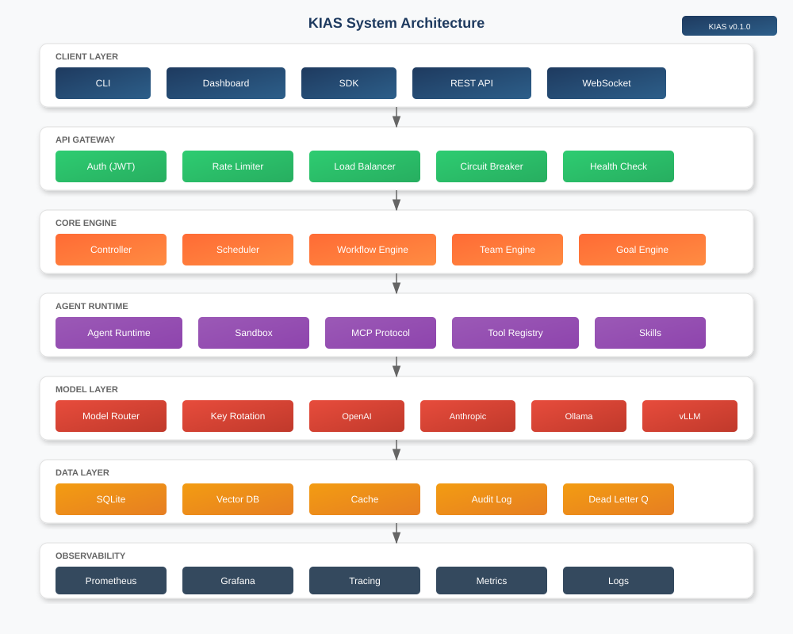

<p align="center">
  
</p>

<p align="center">
  <strong>Build AI Agents That Actually Work in Production</strong>
</p>

<p align="center">
  <a href="https://github.com/Andy-ckm/KIAS/blob/main/LICENSE"></a>
  <a href="https://github.com/Andy-ckm/KIAS/actions"></a>
  <a href="https://www.rust-lang.org"></a>
  <a href="https://github.com/Andy-ckm/KIAS"></a>
</p>

---

## Why KIAS Exists

### The Problem: AI Agents Break in Production

You built an AI agent demo that works great. But when you try to run it in production:

| What Happens | Why It Hurts |
|--------------|--------------|
| 💥 **Process crashes** | All agent state is lost. Hours of work, gone. |
| 🔄 **One error kills everything** | No retry, no recovery. Manual restart required. |
| 👻 **No visibility** | Can't see what agents are doing. Debugging is blind guessing. |
| 🚫 **No isolation** | One bad agent affects all others. No resource limits. |
| 🐍 **Python is slow** | High latency, high memory. Can't scale to real workloads. |
| 🔒 **Vendor lock-in** | Hardcoded to one LLM. Switching providers = rewrite code. |

### The Solution: KIAS Framework

KIAS is a **production-grade AI Agent framework** built in Rust that solves these problems:

```
┌─────────────────────────────────────────────────────────────────┐
│  YOUR AGENT DEMO                                                │
│  ┌─────────────┐                                                │
│  │  Agent Code  │  ← This part is easy                          │
│  └─────────────┘                                                │
├─────────────────────────────────────────────────────────────────┤
│  KIAS FRAMEWORK (What we provide)                               │
│  ┌─────────┐ ┌─────────┐ ┌─────────┐ ┌─────────┐ ┌─────────┐  │
│  │ State   │ │ Error   │ │ Monitor │ │ Isolate │ │ Scale   │  │
│  │ Persist │ │ Recovery│ │ & Alert │ │ & Limit │ │ & Perf  │  │
│  └─────────┘ └─────────┘ └─────────┘ └─────────┘ └─────────┘  │
│  ↓ Saves    ↓ Auto-retry ↓ Real-time ↓ Multi-  ↓ Rust +   │
│    to DB      on failure    metrics    tenant     Tokio     │
└─────────────────────────────────────────────────────────────────┘
```

---

## What KIAS Does (Features → Benefits)

### 1️⃣ State Persistence (Never Lose Work)

**Problem:** Agent crashes = start over  
**KIAS Solution:** SQLite persistence + graceful shutdown  
**Result:** Zero data loss on restart. Agents resume where they left off.

```rust
// KIAS automatically saves agent state
// You just focus on agent logic
```

### 2️⃣ Error Recovery (Self-Healing Agents)

**Problem:** One error kills the entire workflow  
**KIAS Solution:** Dead Letter Queue + Circuit Breakers + Auto-retry  
**Result:** Failed tasks are queued and retried. System stays healthy.

```
Normal:  Request → Agent → ❌ Error → System Down
KIAS:    Request → Agent → ❌ Error → DLQ → Retry → ✅ Success
```

### 3️⃣ Real-Time Monitoring (See Everything)

**Problem:** Can't see what agents are doing  
**KIAS Solution:** Prometheus metrics + Health checks + WebSocket events  
**Result:** Real-time visibility into every agent's performance.

```bash
# Check agent health
curl http://localhost:8080/healthz

# View metrics
curl http://localhost:9090/metrics
```

### 4️⃣ Multi-Tenant Isolation (Safe Multi-User)

**Problem:** One bad agent affects all others  
**KIAS Solution:** Resource quotas + Namespace isolation  
**Result:** Each tenant gets isolated resources. No interference.

### 5️⃣ Blazing Performance (10x Faster)

**Problem:** Python is too slow for production  
**KIAS Solution:** Rust + Tokio async runtime  
**Result:** 10x faster, 10x less memory. Handle thousands of concurrent agents.

| Metric | Python | KIAS (Rust) |
|--------|--------|-------------|
| Latency | 100ms+ | <10ms |
| Memory | 500MB+ | 50MB |
| Concurrent | 100s | 10,000s |

### 6️⃣ Multi-Provider Support (No Lock-In)

**Problem:** Hardcoded to one LLM provider  
**KIAS Solution:** Abstract model router with 10+ providers  
**Result:** Switch between OpenAI, Anthropic, Ollama, vLLM without code changes.

```toml
# Switch providers by changing config, not code
[model]
provider = "openai"  # or "anthropic", "ollama", "vllm"
```

---

## Quick Start (5 Minutes)

### Step 1: Install KIAS

```bash
# One-liner install
curl -fsSL https://raw.githubusercontent.com/Andy-ckm/KIAS/main/install.sh | sh
```

### Step 2: Configure Your LLM

```bash
# Initialize config
kias config init

# Edit config
nano ~/.kias/config.toml
```

```toml
[model]
provider = "openai"
api_key = "sk-your-key-here"
model = "gpt-4o"

# Or use local Ollama (free, no API key)
# provider = "ollama"
# endpoint = "http://localhost:11434"
# model = "llama3.1:8b"
```

### Step 3: Start KIAS

```bash
# Start server
kias server start

# Open dashboard
open http://localhost:8080
```

### Step 4: Create Your First Agent

```yaml
# my-agent.yaml
name: my-agent
description: A helpful assistant
model: gpt-4o
system_prompt: You are a helpful assistant.
```

```bash
# Deploy agent
kias agent create --file my-agent.yaml

# Run agent
kias agent invoke --name my-agent --text "Hello!"
```

---

## System Architecture

<p align="center">
  
</p>

| Layer | What It Does | Why It Matters |
|-------|--------------|----------------|
| **Client** | CLI, Dashboard, SDK | Easy to use from anywhere |
| **Gateway** | Auth, Rate Limit, Load Balance | Secure, fair, scalable |
| **Core** | Controller, Scheduler, Workflow | Orchestrate complex tasks |
| **Runtime** | Agent, Sandbox, MCP | Safe agent execution |
| **Model** | Router, Multi-provider | Switch LLMs freely |
| **Data** | SQLite, Vector DB, Cache | Fast, reliable storage |
| **Observability** | Metrics, Tracing, Health | See everything |

---

## Model Support

### Cloud APIs (Production-Ready)

| Provider | Models | Setup |
|----------|--------|-------|
| **OpenAI** | GPT-4o, GPT-4, GPT-3.5 | `OPENAI_API_KEY` |
| **Anthropic** | Claude 3.5 Sonnet, Claude 3 Opus | `ANTHROPIC_API_KEY` |
| **Google** | Gemini 1.5 Pro, Gemini 1.5 Flash | `GOOGLE_API_KEY` |
| **Azure OpenAI** | All OpenAI models | `AZURE_OPENAI_ENDPOINT` |
| **AWS Bedrock** | Claude, Llama, Mistral | `AWS_ACCESS_KEY_ID` |
| **OpenRouter** | 100+ models | `OPENROUTER_API_KEY` |

### Local Models (Free, No API Key)

| Server | Install | Start | Best For |
|--------|---------|-------|----------|
| **Ollama** | `curl -fsSL https://ollama.com/install.sh \| sh` | `ollama serve` | Development |
| **vLLM** | `pip install vllm` | `vllm serve` | Production |
| **llama.cpp** | Download from GitHub | `llama-server` | Edge devices |

---

## CLI Commands

```bash
# Agent Management
kias agent list                          # List all agents
kias agent create --file agent.yaml      # Create agent
kias agent invoke --name my-agent --text "Hello"  # Run agent

# Server Management
kias server start                        # Start server
kias server start --daemon               # Start in background
kias server stop                         # Stop server
kias server status                       # Check status

# Configuration
kias config init                         # Initialize config
kias config show                         # Show config
```

---

## Hardware Requirements

### Minimum (Development)
- CPU: 2 cores
- RAM: 4 GB
- Storage: 10 GB

### Recommended (Production)
- CPU: 4+ cores
- RAM: 8+ GB
- Storage: 50+ GB SSD

### For Local Models
| Model Size | GPU VRAM | System RAM |
|------------|----------|------------|
| 7B params | 8 GB | 16 GB |
| 13B params | 16 GB | 32 GB |
| 70B params | 48+ GB | 64+ GB |

---

## Why Choose KIAS?

| Feature | KIAS | LangChain | AutoGen |
|---------|------|-----------|---------|
| **Language** | Rust | Python | Python |
| **Performance** | 10x faster | Slow | Slow |
| **Production Ready** | ✅ Yes | ❌ Demo only | ❌ Demo only |
| **State Persistence** | ✅ SQLite | ❌ No | ❌ No |
| **Error Recovery** | ✅ DLQ + Circuit Breakers | ❌ No | ❌ No |
| **Multi-Provider** | ✅ 10+ providers | ✅ Yes | ✅ Yes |
| **Multi-Tenant** | ✅ Yes | ❌ No | ❌ No |
| **Monitoring** | ✅ Prometheus | ❌ No | ❌ No |

---

## Documentation

- 📄 [Architecture Decision Records](docs/adr/)
- 📐 [Design Documents](docs/design-docs/)
- 🔗 [Traceability Matrix](docs/traceability/)
- 📊 [LiteLLM Analysis](docs/litellm-analysis.md)

---

## Contributing

We welcome contributions! See [CONTRIBUTING.md](CONTRIBUTING.md) for details.

1. Fork the repository
2. Create your feature branch (`git checkout -b feature/amazing-feature`)
3. Run tests (`cargo test --workspace`)
4. Commit your changes (`git commit -m 'Add amazing feature'`)
5. Push to the branch (`git push origin feature/amazing-feature`)
6. Open a Pull Request

---

## License

Copyright © 2024 KIAS Contributors

Licensed under the Apache License, Version 2.0. See [LICENSE](LICENSE) for details.

---

<p align="center">
  Made with ❤️ by the KIAS Team
</p>
