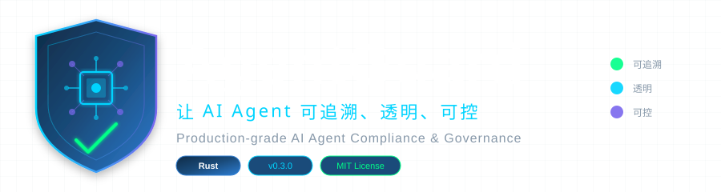

<p align="center">
  
</p>

<h1 align="center">KIAS</h1>
<p align="center"><strong>Policy-driven infrastructure for operating AI agents safely.</strong></p>
<p align="center">A modular Rust workspace for scheduling, lifecycle control, workflows, observability, audit, and security boundaries.</p>

<p align="center">
  <a href="https://github.com/Andy-ckm/KIAS/actions/workflows/ci.yml"></a>
  <a href="https://github.com/Andy-ckm/KIAS/actions/workflows/codeql.yml"></a>
  <a href="https://scorecard.dev/viewer/?uri=github.com/Andy-ckm/KIAS"></a>
  <a href="LICENSE"></a>
</p>

> [!IMPORTANT]
> KIAS is a pre-1.0 project under active development. It is suitable for research, evaluation, and controlled pilots. It has not completed an independent security audit, and production deployment requires threat modeling, hardened configuration, external secret management, and operational review.

## Why KIAS exists

Building an agent demo is easy; operating many agents predictably is not. Real systems need lifecycle control, policy enforcement, scheduling, recovery, auditability, and bounded access to external tools.

KIAS treats an agent as a managed resource rather than an unbounded script. The project focuses on reusable infrastructure concerns:

- declare and track agent lifecycle state;
- schedule work using resource and cache signals;
- execute workflows with retries, checkpoints, cancellation, and recovery;
- enforce authorization, tool, budget, and autonomy policies;
- expose metrics and pseudonymous audit events;
- isolate tool execution behind explicit security boundaries;
- minimize and redact sensitive data by default.

## Architecture

```text
┌──────────────────────────────────────────────────────────────┐
│                     API and control plane                    │
│               REST · gRPC · WebSocket · TLS                 │
├───────────────────┬───────────────────┬──────────────────────┤
│ Scheduler         │ Lifecycle control │ Workflow / goal loop │
│ placement policy  │ reconcile/recover │ checkpoint / retry   │
├───────────────────┼───────────────────┼──────────────────────┤
│ Agent teams       │ Policy engine     │ Observability / audit │
│ worker / verifier │ tool / role / cost│ metrics / traces      │
├───────────────────┴───────────────────┴──────────────────────┤
│ Storage · cache · knowledge · integration adapters           │
├──────────────────────────────────────────────────────────────┤
│ Common types, configuration, masking, errors, protocols      │
└──────────────────────────────────────────────────────────────┘
```

The repository is a Rust workspace split into focused crates. Dependencies are intended to flow from common types and storage toward orchestration and API layers, keeping security-sensitive boundaries reviewable.

See [`docs/architecture.md`](docs/architecture.md) for the detailed module map.

## Current capabilities

| Area | Examples |
|---|---|
| Lifecycle | desired/observed state, health checks, retries, recovery |
| Scheduling | round-robin, load-aware, resource-aware, cache-aware policies |
| Workflows | DAG execution, conditional routing, fan-out, checkpoints |
| Agent collaboration | worker/verifier roles, task delegation, bounded memory |
| Policies | RBAC, tool policy, autonomy levels, budgets, rate limits |
| Interfaces | REST, gRPC, WebSocket, agent-to-agent and tool protocols |
| Data | embedded persistence, cache, document and knowledge components |
| Security | TLS options, redacted credential types, secret references, privacy gates |
| Operations | metrics, traces, health endpoints, pseudonymous audit records |

A capability appearing in the workspace does not imply every adapter or backend is production-ready. Unsupported or incomplete integrations must fail closed.

## Quickstart

### Prerequisites

- a current stable Rust toolchain;
- Git;
- optional external services only for the specific integration being tested.

### Build and verify

```bash
git clone https://github.com/Andy-ckm/KIAS.git
cd KIAS

cargo build --workspace --all-features
cargo test --workspace --all-features
cargo clippy --workspace --all-targets --all-features -- -D warnings
```

Inspect the command-line interface:

```bash
cargo run -p kias-main --bin kias -- --help
```

Configuration starts from [`config/default.toml`](config/default.toml). Supply secrets through environment variables or an external secret provider; never commit a populated `.env` file.

## Minimal security model

KIAS assumes that prompts, model output, uploaded files, webhook bodies, identity claims, and tool parameters may be hostile or sensitive.

Default project expectations are:

- authentication is enabled before exposing management APIs;
- credentials never use derived `Debug` or plaintext serialization;
- request logs exclude query strings and message bodies;
- webhook adapters verify origin and replay windows or fail closed;
- raw external payload retention is disabled by default;
- audit subjects are pseudonymous where direct identity is unnecessary;
- tool execution is restricted by explicit policy and isolation;
- dependency, static-analysis, secret, privacy, and provenance checks run in CI.

Read [`SECURITY.md`](SECURITY.md), [`PRIVACY.md`](PRIVACY.md), and [`docs/threat-model.md`](docs/threat-model.md) before deployment.

## Project status

The project uses pre-1.0 semantic versioning. Interfaces may change while security boundaries and deployment contracts are stabilized.

Verified repository gates include:

- workspace build and tests;
- formatting and Clippy with warnings denied;
- dashboard lint and build;
- CodeQL analysis;
- OpenSSF Scorecard analysis;
- dependency update automation;
- masked secret, PII, and private-organization scanning.

Known limitations and readiness criteria are maintained in [`docs/project-status.md`](docs/project-status.md). Planned work is tracked in [`ROADMAP.md`](ROADMAP.md).

## Documentation

- [Architecture](docs/architecture.md)
- [Development guide](docs/development.md)
- [API documentation](docs/api.md)
- [Threat model](docs/threat-model.md)
- [Project status and evidence](docs/project-status.md)
- [Security policy](SECURITY.md)
- [Privacy policy](PRIVACY.md)
- [Support policy](SUPPORT.md)
- [Release process](RELEASING.md)

## Contributing

Contributions that improve correctness, security, privacy, interoperability, documentation, and user experience are welcome.

Please read:

- [`CONTRIBUTING.md`](CONTRIBUTING.md)
- [`CODE_OF_CONDUCT.md`](CODE_OF_CONDUCT.md)
- [`GOVERNANCE.md`](GOVERNANCE.md)
- [`MAINTAINERS.md`](MAINTAINERS.md)

For vulnerabilities or privacy incidents, use the private process in [`SECURITY.md`](SECURITY.md), not a public issue.

## Independence and data policy

KIAS is a general-purpose community project. The public repository must not contain employer, customer, partner, tenant, internal-system, or personal identifiers. Examples use synthetic data and reserved domains. The project does not claim endorsement by, or affiliation with, any employer or customer.

## License

KIAS is released under the [MIT License](LICENSE).
