# KIAS

**Enterprise-grade AI Agent framework in Rust.**

[](https://www.rust-lang.org/)
[]()
[]()

---

## Why KIAS Exists

**Problem 1: Other frameworks don't handle production**

Most AI Agent frameworks crash on `SIGTERM`, lose data on restart, and can't handle failures.

**KIAS fix**: Graceful shutdown, deep health checks, dead letter queues, audit logging, circuit breakers.

---

**Problem 2: No multi-tenant isolation**

Enterprise customers need resource quotas and namespace isolation.

**KIAS fix**: Per-tenant CPU/memory/GPU limits, namespace isolation, fair scheduling, tenant stats.

---

**Problem 3: Python hits performance walls**

High latency, high memory, can't handle concurrency.

**KIAS fix**: Rust — zero-copy, memory safe, Tokio async, sub-millisecond latency.

---

**Problem 4: No observability**

Most frameworks are black boxes.

**KIAS fix**: Prometheus metrics, distributed tracing, structured logging, WebSocket real-time push.

---

## Hardware Requirements

### Minimum (Development/Testing)

| Component | Requirement |
|-----------|-------------|
| CPU | 4 cores (x86_64 or ARM64) |
| RAM | 8 GB |
| Storage | 20 GB SSD |
| OS | Linux (Ubuntu 22.04+), macOS 12+, Windows WSL2 |

### Recommended (Production)

| Component | Requirement |
|-----------|-------------|
| CPU | 8+ cores |
| RAM | 32+ GB |
| Storage | 100+ GB NVMe SSD |
| GPU | NVIDIA GPU with 8+ GB VRAM (for local models) |

### For Local Model Inference

| Model Size | GPU VRAM | System RAM | Example Models |
|------------|----------|------------|----------------|
| 7B params | 8 GB | 16 GB | Llama 3.1 7B, Qwen 2.5 7B |
| 13B params | 16 GB | 32 GB | Llama 3.1 13B, CodeLlama 13B |
| 70B params | 48+ GB | 64+ GB | Llama 3.1 70B (quantized) |

> **Note**: CPU-only inference is supported but significantly slower. Recommended for development only.

---

## System Architecture

```mermaid
graph TB
    subgraph "Client Layer"
        CLI[CLI Tool<br/>kias-cli]
        Dashboard[Web Dashboard<br/>React + TypeScript]
        SDK[SDK<br/>Rust / Python / JS]
    end

    subgraph "API Gateway"
        API[API Server<br/>Axum + WebSocket]
        Auth[Auth & RBAC<br/>JWT / OAuth / API Key]
        RateLimit[Rate Limiter<br/>Per-tenant quotas]
    end

    subgraph "Core Engine"
        Controller[Controller<br/>Task orchestration]
        Scheduler[Scheduler<br/>Cron-based jobs]
        WorkflowEngine[Workflow Engine<br/>DAG execution]
        TeamEngine[Team Engine<br/>Multi-agent collab]
    end

    subgraph "Agent Runtime"
        Agent[Agent Runtime<br/>Sandboxed execution]
        Sandbox[Code Sandbox<br/>Docker / Wasm / nsjail]
        MCPProtocol[MCP Protocol<br/>Tool integration]
    end

    subgraph "Model Layer"
        ModelRouter[Model Router<br/>Load balancing]
        KeyRotation[Key Rotation<br/>Smart failover]
        CloudAPIs[Cloud APIs<br/>OpenAI / Anthropic / Google]
        LocalModels[Local Models<br/>Ollama / vLLM / llama.cpp]
    end

    subgraph "Data Layer"
        DataStore[(SQLite<br/>Agents, Tasks, Workflows)]
        VectorStore[(Vector DB<br/>HNSW embeddings)]
        Cache[(Cache<br/>In-memory)]
        AuditLog[(Audit Log<br/>Compliance)]
    end

    subgraph "Observability"
        Metrics[Prometheus<br/>Metrics]
        Tracing[Distributed Tracing<br/>Request lifecycle]
        HealthCheck[Health Checks<br/>Deep / Liveness]
        DLQ[Dead Letter Queue<br/>Failed tasks]
    end

    subgraph "Infrastructure"
        GracefulShutdown[Graceful Shutdown<br/>SIGTERM handling]
        CircuitBreaker[Circuit Breaker<br/>Auto-recovery]
        MultiTenant[Multi-tenant<br/>Isolation]
    end

    %% Client connections
    CLI --> API
    Dashboard --> API
    SDK --> API

    %% API Gateway
    API --> Auth
    API --> RateLimit
    Auth --> Controller

    %% Core Engine
    Controller --> Agent
    Controller --> Scheduler
    Controller --> WorkflowEngine
    Controller --> TeamEngine

    %% Agent Runtime
    Agent --> Sandbox
    Agent --> MCPProtocol
    Agent --> ModelRouter

    %% Model Layer
    ModelRouter --> KeyRotation
    ModelRouter --> CloudAPIs
    ModelRouter --> LocalModels

    %% Data Layer
    Controller --> DataStore
    Agent --> DataStore
    Controller --> VectorStore
    Controller --> Cache
    Controller --> AuditLog

    %% Observability
    Controller --> Metrics
    API --> Tracing
    HealthCheck --> Controller
    Controller --> DLQ

    %% Infrastructure
    Controller --> GracefulShutdown
    Controller --> CircuitBreaker
    Controller --> MultiTenant

    %% Styling
    classDef client fill:#e1f5fe,stroke:#01579b
    classDef api fill:#f3e5f5,stroke:#4a148c
    classDef core fill:#e8f5e8,stroke:#1b5e20
    classDef agent fill:#fff3e0,stroke:#e65100
    classDef model fill:#fce4ec,stroke:#880e4f
    classDef data fill:#f1f8e9,stroke:#33691e
    classDef observability fill:#e0f2f1,stroke:#004d40
    classDef infra fill:#f5f5f5,stroke:#424242

    class CLI,Dashboard,SDK client
    class API,Auth,RateLimit api
    class Controller,Scheduler,WorkflowEngine,TeamEngine core
    class Agent,Sandbox,MCPProtocol agent
    class ModelRouter,KeyRotation,CloudAPIs,LocalModels model
    class DataStore,VectorStore,Cache,AuditLog data
    class Metrics,Tracing,HealthCheck,DLQ observability
    class GracefulShutdown,CircuitBreaker,MultiTenant infra
```



---

## Installation

### One-liner Install (recommended)

```bash
curl -fsSL https://raw.githubusercontent.com/Andy-ckm/KIAS/main/install.sh | sh
```

### Docker

```bash
# Quick start
docker run -p 8080:8080 ghcr.io/Andy-ckm/kias:latest

# With docker-compose
git clone https://github.com/Andy-ckm/KIAS
cd KIAS
docker-compose up -d
```

### Cargo Install

```bash
cargo install kias-cli
```

### From Source

```bash
git clone https://github.com/Andy-ckm/KIAS
cd KIAS
cargo build --release
./target/release/kias-main
```

---

## Quickstart

```bash
# Initialize config
kias config init

# Start server
kias server start

# Dashboard at http://localhost:8080
```

---

## Model Support

KIAS supports **both cloud APIs and local models**:

### Cloud API Providers

| Provider | Models | Configuration |
|----------|--------|---------------|
| OpenAI | GPT-4o, GPT-4, GPT-3.5 | `OPENAI_API_KEY` |
| Anthropic | Claude 3.5 Sonnet, Claude 3 Opus | `ANTHROPIC_API_KEY` |
| Google | Gemini 1.5 Pro, Gemini 1.5 Flash | `GOOGLE_API_KEY` |
| Azure OpenAI | All OpenAI models | `AZURE_OPENAI_ENDPOINT` |
| AWS Bedrock | Claude, Llama, Mistral | `AWS_ACCESS_KEY_ID` |
| OpenRouter | 100+ models | `OPENROUTER_API_KEY` |

### Local Model Servers

| Server | Setup | Models |
|--------|-------|--------|
| **Ollama** | `ollama serve` | Llama 3.1, Qwen 2.5, CodeLlama, etc. |
| **vLLM** | `vllm serve` | Any HuggingFace model |
| **llama.cpp** | `llama-server` | GGUF quantized models |
| **Text Generation Inference** | `text-generation-launcher` | HuggingFace models |
| **LocalAI** | `localai` | OpenAI-compatible API |

### Configuration Example

```toml
# config/kias.toml

[model]
# Cloud API
provider = "openai"
api_key = "${OPENAI_API_KEY}"
model = "gpt-4o"

# Or local Ollama
# provider = "ollama"
# endpoint = "http://localhost:11434"
# model = "llama3.1:8b"

# Or local vLLM
# provider = "openai"  # vLLM exposes OpenAI-compatible API
# endpoint = "http://localhost:8000"
# model = "meta-llama/Llama-3.1-8B-Instruct"
```

---

## Core Features

| Feature | Status | Description |
|---------|--------|-------------|
| Graceful Shutdown | ✅ | SIGTERM handling, subsystem cleanup |
| Deep Health Checks | ✅ | Memory, disk, CPU, queue monitoring |
| Dead Letter Queue | ✅ | Failed task archival, retry strategies |
| Audit Logging | ✅ | SQLite persistence, survives restarts |
| Circuit Breakers | ✅ | Auto-cut, rate limiting, degradation |
| Key Rotation | ✅ | Smart pick, cooldown recovery |
| Multi-tenant | ✅ | Resource quotas, namespace isolation |
| WebSocket | ✅ | Real-time event streaming |
| Dashboard | ✅ | React + TypeScript frontend |
| Local Models | ✅ | Ollama, vLLM, llama.cpp support |

---

## Tech Stack

- **Language**: Rust 1.95
- **Async**: Tokio
- **Web**: Axum
- **Database**: SQLite via sqlx
- **Cache**: In-memory (Redis-compatible planned)
- **Metrics**: Prometheus
- **Frontend**: React, TypeScript, TailwindCSS

---

## Documentation

- [Architecture Decision Records](docs/adr/)
- [Design Documents](docs/design-docs/)
- [Traceability Matrix](docs/traceability/)
- [LiteLLM Analysis](docs/litellm-analysis.md)

---

## Contributing

1. Fork the repository
2. Create your feature branch (`git checkout -b feature/amazing-feature`)
3. Run tests (`cargo test --workspace`)
4. Commit your changes (`git commit -m 'Add amazing feature'`)
5. Push to the branch (`git push origin feature/amazing-feature`)
6. Open a Pull Request

---

## License

MIT
