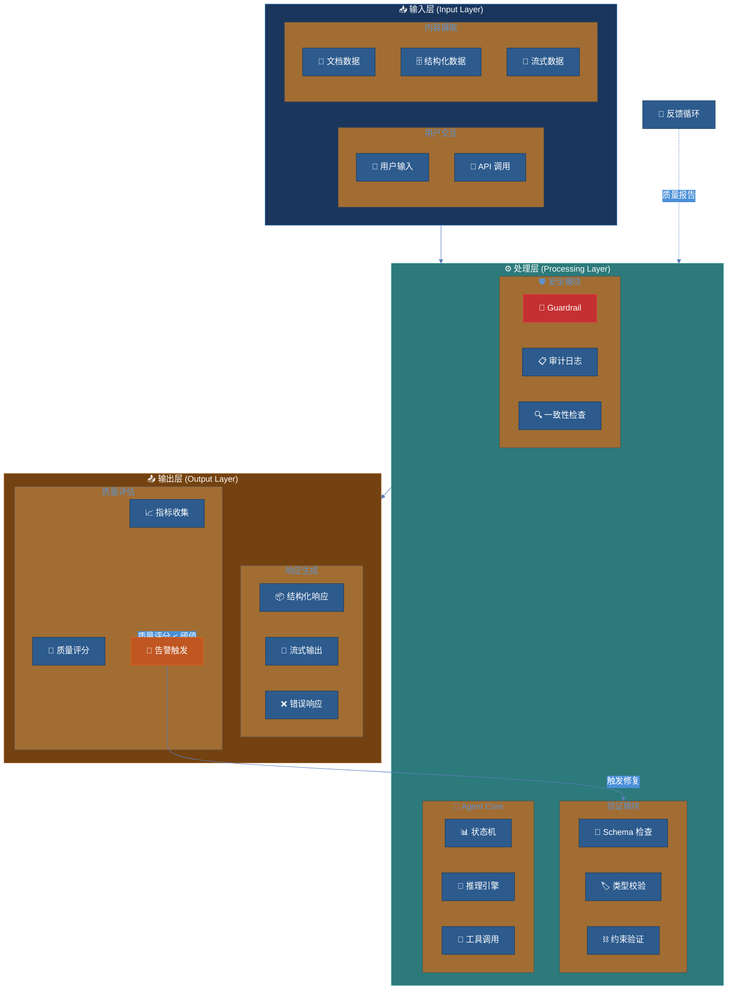
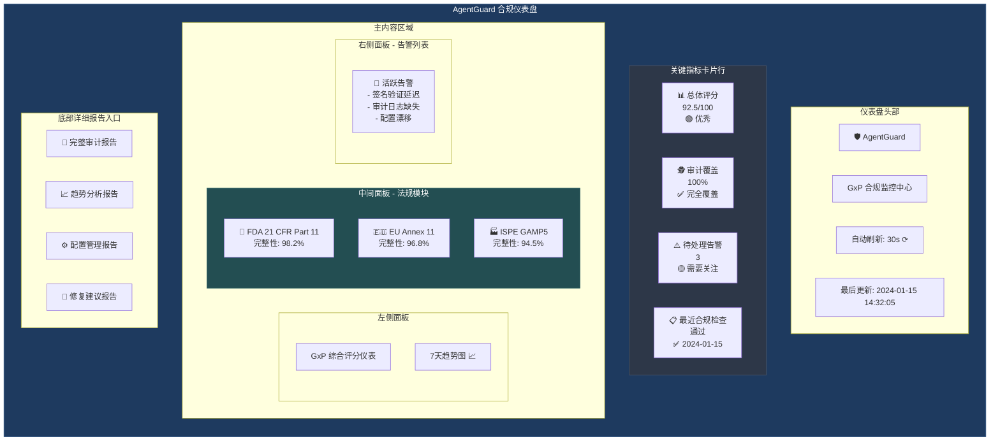
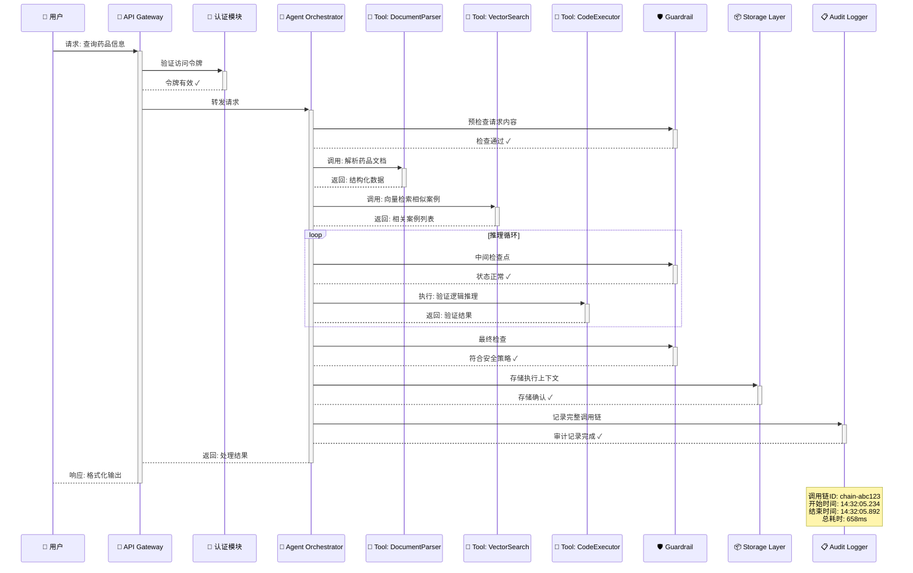

# AgentGuard Harness 工程可视化系统设计

**文档版本**: 1.0
**架构师**: MiniMax (前台协调)
**日期**: 2026-05-22
**项目代号**: Harness-Visualization-System (HVS)

---

## 一、系统概述与愿景

AgentGuard Harness 工程可视化系统是将 AI Agent 的运行过程工程化、可见化、可控化的核心基础设施。在当前 Agent 系统中，开发者往往面临"黑盒困惑"——无法清晰了解 Agent 的决策过程、无法追溯行为根源、无法提前预防风险。本系统通过将 Harness 概念（多层级反馈闭环、治理对象闭合、工程 UI 化）落地为可操作的可视化界面，使 AI Agent 的开发与运维从"玄学"走向"工程"。

### 1.1 核心价值主张

| 维度 | 传统 Agent 系统 | AgentGuard HVS |
|------|-----------------|-----------------|
| 可观测性 | 日志散乱，难以追溯 | 全链路追踪，端到端可视化 |
| 可控性 | 事后补救，风险暴露 | 事前规则，事中拦截，事后审计 |
| 可优化性 | 迭代盲目，效果难评 | 反馈闭环驱动，量化改进 |
| 合规性 | 合规意识薄弱 | GxP/EU AI Act 内置支持 |

### 1.2 技术栈总览

```
┌─────────────────────────────────────────────────────────────────┐
│                        前端展示层                                 │
│  React 18 + Next.js 14 + TypeScript + TailwindCSS                │
│  Zustand 状态管理 | TanStack Query 数据获取 | Recharts 可视化    │
└────────────────────────────┬────────────────────────────────────┘
                             │ HTTPS/WSS
┌────────────────────────────▼────────────────────────────────────┐
│                        API 网关层                                 │
│  Rust Axum 0.7 | Tower 中间件 | JWT 鉴权 | Rate Limiting        │
└────────────────────────────┬────────────────────────────────────┘
                             │
┌────────────────────────────▼────────────────────────────────────┐
│                     数据聚合层 (Collection Layer)                 │
│  Event Collector | Stream Processor | Aggregation Engine         │
└────────────────────────────┬────────────────────────────────────┘
                             │
          ┌──────────────────┼──────────────────┐
          │                  │                  │
          ▼                  ▼                  ▼
┌─────────────────┐ ┌─────────────────┐ ┌─────────────────┐
│   PostgreSQL     │ │   ClickHouse    │ │     Redis        │
│   (事务数据)      │ │   (分析数据)     │ │   (缓存/实时)    │
│   审计轨迹       │ │   行为分析       │ │   会话状态       │
│   合规记录       │ │   性能指标       │ │   实时队列       │
└─────────────────┘ └─────────────────┘ └─────────────────┘
```

### 1.3 Rust Monorepo 架构映射

AgentGuard 的 25 个 crate 形成完整的垂直集成，数据流经每个层级：

```
agent-runtime (运行时核心)
       │
       ├──► audit-trail (审计轨迹)
       │         │
       │         └──► compliance-security (合规安全)
       │                   │
       │                   └──► enterprise-compliance (企业合规)
       │
       ├──► tool-executor (工具执行器)
       │         │
       │         └──► monitor (监控)
       │                   │
       │                   └──► auto-loop (自动闭环)
       │
       ├──► knowledge (知识库)
       │         │
       │         └──► document-management (文档管理)
       │
       └──► 多 crate 间共享类型定义 (shared-types)
                    │
                    └──► API 层统一序列化
```

---

## 二、核心组件详细设计

### 2.1 生命周期视图 (Lifecycle View)

#### 2.1.1 组件职责

生命周期视图是 AgentGuard HVS 的核心入口，呈现每个 Agent 从创建到优化的完整演进过程。该视图将 Agent 的运行状态建模为状态机，用户可以直观看到 Agent 当前所处阶段、状态转换历史、以及各阶段的性能指标。

#### 2.1.2 数据源 crate

| Crate | 角色 | 提供数据 |
|-------|------|----------|
| `agent-runtime` | 运行时核心 | Agent 实例创建、状态变更、生命周期事件 |
| `audit-trail` | 审计轨迹 | 状态转换的详细记录、操作者、时间戳 |
| `auto-loop` | 自动闭环 | 优化建议、反馈评分、重启触发 |
| `monitor` | 监控指标 | 各阶段的延迟、吞吐、错误率 |

#### 2.1.3 状态机定义

```
┌─────────┐    create    ┌─────────┐    execute    ┌──────────┐
│ Created │────────────►│ Ready   │──────────────►│ Running  │
└─────────┘              └─────────┘               └──────────┘
                            ▲                         │
                            │                         │
                      reconfigure                   ┌──┴───┐
                            │               success │      │ failure
                            │                    ┌──┘      └──┐
                            │                    ▼            ▼
                       ┌────────┐          ┌────────┐    ┌─────────┐
                       │Suspended│          │Complete│    │ Failed  │
                       └────────┘          └────────┘    └─────────┘
                                                       │
                                               audit   ▼
                                           ┌────────────────┐
                                           │   Audited      │
                                           └────────────────┘
                                                    │
                                              feedback
                                                    ▼
                                           ┌────────────────┐
                                           │   Optimized    │
                                           └────────────────┘
```

#### 2.1.4 展示内容

**主视图区域**：
- 时间线视图：以横向时间轴展示 Agent 生命周期，标注每个关键事件点
- 状态分布图：实时饼图展示当前所有 Agent 的状态分布
- 阶段耗时分析：瀑布图展示各阶段耗时占比，识别瓶颈
- 健康度仪表：综合评分（0-100）展示 Agent 整体健康状况

**详情展开**：
- 执行日志：实时流式日志输出，支持关键词过滤
- 资源消耗：CPU/内存/Token 消耗曲线
- 父子关系：若 Agent 由其他 Agent 创建，展示调用链

#### 2.1.5 用户交互

| 交互 | 功能描述 | 技术实现 |
|------|----------|----------|
| 点击状态节点 | 展开该状态的详细参数和时间区间 | React 状态管理 + 时间范围查询 |
| 拖拽时间轴 | 调整查看的时间窗口 | Canvas 渲染 + 虚拟滚动 |
| 右键菜单 | 操作 Agent：暂停、恢复、终止、重置 | Context Menu API |
| 批量选择 | 多选 Agent 进行批量操作 | Checkbox 选择 + 批量 API |
| 导出报告 | 将生命周期报告导出为 PDF/CSV | 服务端渲染 + 文件流下载 |

---

### 2.2 治理面板 (Governance Panel)

#### 2.2.1 组件职责

治理面板是 AgentGuard "可控性" 定位的核心载体，提供规则分发、控制点配置、闸门状态监控三大功能。治理的本质是将组织的管理意图编码为可执行的策略，并通过可视化界面让运维人员实时掌握治理状态。

#### 2.2.2 数据源 crate

| Crate | 角色 | 提供数据 |
|-------|------|----------|
| `compliance-security` | 合规安全引擎 | 策略定义、规则匹配结果、控制点状态 |
| `enterprise-compliance` | 企业合规层 | 规则分发拓扑、继承关系、合规评分 |
| `audit-trail` | 审计轨迹 | 规则变更历史、控制点触发记录 |
| `document-management` | 文档管理 | 规则对应的 SOP 文档、审批记录 |

#### 2.2.3 规则分发拓扑

```
                    ┌──────────────────┐
                    │  Global Rules    │
                    │  (全局规则集)     │
                    └────────┬─────────┘
                             │
              ┌──────────────┼──────────────┐
              ▼              ▼              ▼
     ┌────────────┐  ┌────────────┐  ┌────────────┐
     │ Dept-A     │  │ Dept-B     │  │ Dept-C     │
     │ 部门规则     │  │ 部门规则    │  │ 部门规则    │
     └─────┬──────┘  └─────┬──────┘  └─────┬──────┘
           │               │               │
      ┌────┴────┐    ┌─────┴────┐    ┌─────┴────┐
      ▼         ▼    ▼          ▼    ▼          ▼
   [Agent-A] [Agent-B]  [Agent-C]  [Agent-D] [Agent-E]
```

规则支持多层嵌套和覆盖：全局规则为基础，部门规则可在此基础上收紧或放宽，Agent 级别规则覆盖上级设置。

#### 2.2.4 控制点类型

| 控制点类型 | 触发时机 | 可配置动作 |
|-----------|----------|-----------|
| Pre-Execute | Agent 执行前 | 拦截、警告、强制确认、修改参数 |
| Post-Execute | Agent 执行后 | 审计记录、通知告警、触发补偿 |
| Resource-Limit | 资源超限时 | 限流、熔断、弹性扩容 |
| Data-Leak | 敏感数据流动时 | 脱敏、加密、阻断 |
| Compliance-Violation | 违反合规规则 | 强制停止、升级审批、记录违规 |

---

### 2.3 反馈循环图 (Feedback Loop Diagram)

#### 2.3.1 组件职责

反馈循环图是 AgentGuard "可优化性" 的核心体现。基于 Harness 概念中的多层级反馈机制，本组件将 Agent 与环境的交互抽象为可视化反馈循环，帮助开发者理解反馈流动路径、识别反馈延迟瓶颈、评估反馈质量。

#### 2.3.2 数据源 crate

| Crate | 角色 | 提供数据 |
|-------|------|----------|
| `auto-loop` | 自动闭环引擎 | 反馈收集、评分计算、优化建议生成 |
| `monitor` | 监控指标 | 反馈延迟、吞吐量、丢弃率 |
| `agent-runtime` | 运行时核心 | 执行结果、环境状态变化 |

#### 2.3.3 三层反馈架构

```
┌─────────────────────────────────────────────────────────────────┐
│                      EXTERNAL FEEDBACK LAYER                     │
│  (外部反馈层 - 人类反馈、监管反馈、业务结果反馈)                    │
│   Human Feedback | Regulator Feedback | Customer | Business     │
└───────────────────────────────┬─────────────────────────────────┘
                                │
┌───────────────────────────────▼─────────────────────────────────┐
│                        PUSH FEEDBACK LAYER                       │
│  (推送反馈层 - 系统事件、指标告警、日志异常)                        │
│   Metrics Stream | Logs Stream | Traces Stream | Events Stream  │
└───────────────────────────────┬─────────────────────────────────┘
                                │
┌───────────────────────────────▼─────────────────────────────────┐
│                       LOCAL FEEDBACK LAYER                       │
│  (本地反馈层 - 工具执行结果、Token 消耗、中间状态)                  │
│   Tool Result | Token Usage | State Change | Error Return       │
│                       ▼                                          │
│              ┌─────────────────┐                                │
│              │   Agent Core    │                                │
│              └─────────────────┘                                │
└─────────────────────────────────────────────────────────────────┘
```

#### 2.3.4 反馈质量评估模型

| 维度 | 指标 | 计算方式 | 权重 |
|------|------|----------|------|
| 时效性 | Feedback Latency | 从事件发生到反馈到达的时间 | 30% |
| 完整性 | Coverage Rate | 有反馈的事件占比 | 25% |
| 准确性 | Precision | 反馈与实际结果的一致性 | 25% |
| 可操作性 | Actionability | 反馈可转化为优化的比例 | 20% |

---

### 2.4 合规仪表盘 (Compliance Dashboard)

#### 2.4.1 组件职责

合规仪表盘是 AgentGuard 面向 GxP/EU AI Act 等监管场景的核心展示组件。它将分散的合规要求转化为可量化的合规评分和风险热力图，帮助合规官快速掌握整体合规状态。

#### 2.4.2 数据源 crate

| Crate | 角色 | 提供数据 |
|-------|------|----------|
| `compliance-security` | 合规安全引擎 | GxP 检查项、EU AI Act 风险等级、PKI 证书状态 |
| `enterprise-compliance` | 企业合规层 | 合规报告、偏见检测结果、公平性指标 |
| `audit-trail` | 审计轨迹 | 完整操作审计、变更历史 |
| `document-management` | 文档管理 | SOP 文档、验证记录、培训记录 |

#### 2.4.3 合规评分体系

```
Overall Compliance Score = Σ(Category_Score × Weight)

Categories:
├── Data Governance (25%)
│   ├── Data Lineage
│   ├── Data Quality
│   └── Data Privacy
├── Model Governance (25%)
│   ├── Model Validation
│   ├── Bias Detection
│   └── Explainability
├── Process Governance (25%)
│   ├── Change Management
│   ├── Risk Assessment
│   └── Audit Trail
└── Operational Governance (25%)
    ├── Access Control
    ├── Incident Response
    └── Continuous Monitoring
```

#### 2.4.4 展示内容

- **合规总览**：大屏展示整体合规评分、各维度得分、趋势曲线
- **风险热力图**：按模块/功能展示风险等级（红/黄/绿）
- **审计时间线**：最近审计事件的流式展示
- **合规差距分析**：当前状态与目标状态的差距，自动生成整改建议

---

### 2.5 Agent 行为追踪 (Agent Behavior Tracing)

#### 2.5.1 组件职责

Agent 行为追踪是 AgentGuard "可追溯性" 的核心体现。它记录 Agent 的每一步决策、每一次工具调用、每一个状态变化，并以调用链的形式可视化展示，帮助开发者理解 Agent 的"思考过程"。

#### 2.5.2 数据源 crate

| Crate | 角色 | 提供数据 |
|-------|------|----------|
| `audit-trail` | 审计轨迹 | 完整操作记录、决策路径 |
| `tool-executor` | 工具执行器 | 工具调用详情、输入输出、耗时 |
| `agent-runtime` | 运行时核心 | Agent 内部状态、推理过程 |
| `monitor` | 监控指标 | 性能指标、资源消耗 |

#### 2.5.3 调用链可视化

```
[Agent] ──create──► [Task]
   │
   ├──think──► "需要查询知识库"
   │              │
   │              ├──tool_call──► [knowledge.search]
   │              │                   │
   │              │                   └──result──► {docs: [...]}
   │              │
   │              └──think──► "找到3篇相关文档"
   │
   ├──tool_call──► [doc-management.lock]
   │                   │
   │                   └──result──► {lock_id: "xxx"}
   │
   ├──think──► "开始处理文档"
   │
   ├──tool_call──► [tool-executor.run]
   │                   │
   │                   ├──input──► {file: "report.docx", action: "analyze"}
   │                   │
   │                   └──output──► {result: "compliant", score: 95}
   │
   └──complete──► [Task Complete]
```

#### 2.5.4 展示内容

- **调用链树**：树形结构展示 Agent 的完整决策路径
- **时间瀑布图**：每个步骤的耗时分布
- **Token 消耗**：每步的 Token 使用量和成本
- **决策分支**：当 Agent 有多个选择时，展示决策树和选择依据

---

## 三、数据流设计

### 3.1 数据采集层

```
┌─────────────────────────────────────────────────────────┐
│                    AgentGuard Crates                      │
│                                                          │
│  agent-runtime ──┐                                      │
│  audit-trail ────┤                                      │
│  compliance-sec ─┼──► Event Bus (Redis Pub/Sub)         │
│  monitor ────────┤         │                             │
│  tool-executor ──┘         ▼                             │
│                    ┌──────────────┐                      │
│                    │ Event        │                      │
│                    │ Collector    │                      │
│                    │ (Rust)       │                      │
│                    └──────┬───────┘                      │
│                           │                              │
│                    ┌──────▼───────┐                      │
│                    │ Stream       │                      │
│                    │ Processor    │                      │
│                    │ (Rust)       │                      │
│                    └──────┬───────┘                      │
│                           │                              │
│              ┌────────────┼────────────┐                 │
│              ▼            ▼            ▼                 │
│        PostgreSQL    ClickHouse     Redis                │
└─────────────────────────────────────────────────────────┘
```

### 3.2 API 层设计

```rust
// Axum 路由设计
Router::new()
    // 生命周期视图
    .route("/api/v1/agents", get(list_agents))
    .route("/api/v1/agents/:id/lifecycle", get(get_lifecycle))
    .route("/api/v1/agents/:id/state", get(get_state))
    // 治理面板
    .route("/api/v1/governance/rules", get(list_rules))
    .route("/api/v1/governance/gates", get(list_gates))
    .route("/api/v1/governance/score", get(get_governance_score))
    // 反馈循环
    .route("/api/v1/feedback/loops", get(list_feedback_loops))
    .route("/api/v1/feedback/quality", get(get_feedback_quality))
    // 合规仪表盘
    .route("/api/v1/compliance/score", get(get_compliance_score))
    .route("/api/v1/compliance/risks", get(get_risk_heatmap))
    .route("/api/v1/compliance/audit", get(get_audit_trail))
    // Agent 行为追踪
    .route("/api/v1/traces/:agent_id", get(get_trace))
    .route("/api/v1/traces/:agent_id/calls", get(get_tool_calls))
    // WebSocket 实时推送
    .route("/ws/events", get(ws_events_handler))
```

### 3.3 前端数据流

```
React Components
       │
       ▼
  Zustand Store ◄── TanStack Query (REST API)
       │                    │
       ▼                    ▼
  Local State          Server State
       │                    │
       ▼                    ▼
  Recharts/D3          WebSocket
  (Visualization)      (Real-time)
```

---

## 四、实现路线图

### P0（第 1 周）— 核心骨架

1. **Rust API 骨架**
   - Axum 项目初始化
   - 基础路由和中间件
   - 从 `audit-trail` 和 `agent-runtime` 采集数据

2. **Lifecycle 视图（MVP）**
   - Agent 列表 + 状态分布图
   - 基础时间线视图
   - 状态转换历史

3. **Agent 行为追踪（MVP）**
   - 基础调用链展示
   - 工具调用详情

### P1（第 2-4 周）— 核心功能

1. **治理面板**
   - 规则分发拓扑图
   - 控制点状态监控
   - 闸门状态灯

2. **合规仪表盘**
   - 合规评分展示
   - 风险热力图
   - 审计时间线

3. **实时数据流**
   - WebSocket 事件推送
   - 实时状态更新

### P2（第 1-2 月）— 高级功能

1. **反馈循环图**
   - 三层反馈架构可视化
   - 反馈质量评估
   - 延迟热力图

2. **高级分析**
   - 趋势预测
   - 异常检测
   - 智能告警

3. **报告导出**
   - PDF/CSV 导出
   - 定时报告
   - 合规报告模板

---

## 五、技术选型建议

| 层级 | 推荐技术 | 备选方案 | 选择理由 |
|------|----------|----------|----------|
| 前端框架 | Next.js 14 | Vite + React | SSR 支持、路由内置、生态成熟 |
| UI 组件 | TailwindCSS + shadcn/ui | Ant Design | 轻量、可定制、符合工程审美 |
| 可视化 | Recharts + D3.js | AntV G6 | Recharts 简单图表、D3 复杂拓扑 |
| 状态管理 | Zustand | Jotai | 轻量、TypeScript 友好 |
| 数据获取 | TanStack Query | SWR | 缓存、重试、乐观更新 |
| 后端框架 | Axum 0.7 | Actix-web | Tower 生态、类型安全 |
| 数据库 | PostgreSQL | — | 事务、JSON 支持、成熟稳定 |
| 分析数据库 | ClickHouse | TimescaleDB | 列式存储、聚合性能 |
| 缓存 | Redis | — | Pub/Sub、缓存、队列 |
| 实时通信 | WebSocket (tokio-tungstenite) | SSE | 双向通信、低延迟 |


---

# AgentGuard Harness 完整设计文档 (续)

---

## 1. 反馈循环架构图（三层质量模型）



### 三层质量模型详解

#### 第一层：数据完整性层 (Data Integrity Layer)

| 质量维度 | 指标定义 | 检查机制 | 阈值标准 |
|---------|---------|---------|---------|
| Schema合规性 | JSON Schema / Protobuf定义符合度 | 自动校验所有入站/出站数据 | 100% 必须满足 |
| 类型安全 | 类型推断准确率 | 静态分析 + 运行时检查 | 错误率 < 0.01% |
| 约束满足 | 业务规则约束覆盖率 | 规则引擎评估 | 覆盖率 ≥ 99.5% |
| 数据一致性 | 跨请求状态一致性 | 事务性验证 | 无数据丢失 |

#### 第二层：Agent行为层 (Agent Behavior Layer)

| 质量维度 | 指标定义 | 检查机制 | 阈值标准 |
|---------|---------|---------|---------|
| 响应一致性 | 相同输入的输出稳定性 | 幂等性测试 + 对比分析 | 一致性 ≥ 95% |
| 推理准确性 | 逻辑推理正确性评分 | 人工标注 + 自动评估 | 准确率 ≥ 90% |
| 工具调用合理性 | 工具选择的精准度 | 工具调用图谱分析 | 精准度 ≥ 85% |
| 状态转换正确性 | 状态机转换符合度 | 状态转移矩阵验证 | 合法转换 100% |

#### 第三层：合规治理层 (Compliance Governance Layer)

| 质量维度 | 指标定义 | 检查机制 | 阈值标准 |
|---------|---------|---------|---------|
| GxP合规性 | FDA 21 CFR Part 11 / EU Annex 11 | 完整审计追踪 | 全覆盖 |
| 审计追溯性 | 操作可追溯性评分 | 审计日志完整性检查 | 100% 可追溯 |
| 数据主权 | 数据隔离与访问控制 | RBAC + 数据加密验证 | 符合率 100% |
| 版本控制 | 配置变更可追溯性 | 版本化配置管理 | 全版本保留 |

### 反馈循环机制

```
┌─────────────────────────────────────────────────────────────┐
│                     反馈循环流程                              │
├─────────────────────────────────────────────────────────────┤
│                                                             │
│   ┌──────────┐    1.执行     ┌──────────┐    2.评估   ┌────┴──┐
│   │  Agent   │ ───────────▶ │ Quality  │ ─────────▶ │ Score │
│   │ Execution│              │ Evaluator│            │ Engine│
│   └────┬─────┘              └──────────┘            └───┬───┘
│        │                        ▲                       │
│        │ 4.调整策略              │ 3.报告反馈            │
│        ▼                        │                       │
│   ┌──────────┐                  │                ┌───────▼────┐
│   │ Config   │ ◀────────────────┘                │ Dashboard  │
│   │  Update  │                                   │  & Alert   │
│   └──────────┘                                   └───────────┘
│                                                             │
│   循环周期: 实时监控 → 5分钟批处理 → 日/周/月度报告           │
└─────────────────────────────────────────────────────────────┘
```

---

## 2. 合规仪表盘与GxP评分系统



### GxP评分体系详细说明

#### 评分维度权重表

| 一级维度 | 权重 | 二级指标 | 子权重 | 计算方式 |
|---------|-----|---------|-------|---------|
| **法规合规性** | 35% | FDA 21 CFR Part 11 | 15% | 加权求和 |
| | | EU Annex 11 | 12% | |
| | | ISPE GAMP5 | 8% | |
| **审计追溯性** | 30% | 操作日志完整性 | 12% | 乘积模型 |
| | | 电子签名有效性 | 10% | |
| | | 版本控制合规性 | 8% | |
| **数据完整性** | 25% | 数据加密强度 | 8% | 最低达标 |
| | | 备份恢复能力 | 9% | |
| | | 数据隔离性 | 8% | |
| **访问控制** | 10% | RBAC实现度 | 5% | 布尔判定 |
| | | 多因素认证 | 3% | |
| | | 会话管理 | 2% | |

#### 评分计算公式

```
GxP_Score = Σ(Dimension_Weight_i × SubDimension_Score_ij × Compliance_Factor_ij)

其中 Compliance_Factor 计算规则:
- 关键项未达标: 整维度得分为0
- 非关键项未达标: 扣20%分值
- 存在已知风险敞口: 额外扣10%
```

### 合规仪表盘数据模型

```typescript
// 合规数据模型
interface ComplianceDashboardData {
  // 基础信息
  dashboardId: string;
  generatedAt: Date;
  refreshInterval: number; // seconds
  
  // GxP评分
  gxpScore: {
    overall: number;           // 0-100
    trend: 'improving' | 'stable' | 'declining';
    previousScore: number;
    delta: number;
  };
  
  // 维度评分
  dimensions: {
    regulatoryCompliance: {
      score: number;
      subDimensions: {
        fda21cfrPart11: { score: number; status: 'compliant' | 'partial' | 'non-compliant'; };
        euAnnex11: { score: number; status: 'compliant' | 'partial' | 'non-compliant'; };
        ispeGamp5: { score: number; status: 'compliant' | 'partial' | 'non-compliant'; };
      };
    };
    auditTraceability: {
      score: number;
      coveragePercent: number;
      lastAuditTimestamp: Date;
    };
    dataIntegrity: {
      score: number;
      encryptionLevel: string;
      backupStatus: 'current' | 'stale' | 'failed';
    };
    accessControl: {
      score: number;
      mfaEnabled: boolean;
      rbacVersion: string;
    };
  };
  
  // 告警状态
  alerts: {
    critical: Alert[];
    warning: Alert[];
    info: Alert[];
  };
  
  // 历史趋势
  trendData: TrendPoint[];
}

// 告警数据结构
interface Alert {
  alertId: string;
  severity: 'critical' | 'high' | 'medium' | 'low';
  category: string;
  title: string;
  description: string;
  affectedComponent: string;
  detectedAt: Date;
  recommendedAction: string;
}
```

### 仪表盘API端点

| 端点 | 方法 | 描述 | 缓存策略 |
|-----|-----|-----|---------|
| `/api/v1/compliance/dashboard` | GET | 获取仪表盘概览数据 | 30s TTL |
| `/api/v1/compliance/score` | GET | 获取GxP综合评分 | 60s TTL |
| `/api/v1/compliance/dimensions` | GET | 获取各维度详细评分 | 60s TTL |
| `/api/v1/compliance/alerts` | GET | 获取活跃告警列表 | 实时 |
| `/api/v1/compliance/trend` | GET | 获取评分趋势数据 | 5min TTL |
| `/api/v1/compliance/report` | POST | 生成合规报告 | 按需生成 |

---

## 3. Agent行为追踪与调用链



### 调用链追踪数据结构

```rust
// Rust 调用链追踪核心结构
use chrono::{DateTime, Utc};
use serde::{Deserialize, Serialize};
use uuid::Uuid;

#[derive(Debug, Clone, Serialize, Deserialize)]
pub struct CallChain {
    /// 调用链唯一标识
    pub chain_id: Uuid,
    
    /// 调用链版本 (用于追踪数据模型变更)
    pub version: String,
    
    /// 调用链元数据
    pub metadata: ChainMetadata,
    
    /// 完整调用节点列表
    pub nodes: Vec<ChainNode>,
    
    /// 调用链状态
    pub status: ChainStatus,
    
    /// 关联的审计信息
    pub audit_info: AuditInfo,
}

#[derive(Debug, Clone, Serialize, Deserialize)]
pub struct ChainMetadata {
    /// 发起用户ID
    pub user_id: String,
    
    /// 请求来源
    pub source: RequestSource,
    
    /// 业务场景标识
    pub business_context: String,
    
    /// 追踪标签 (用于分组分析)
    pub tags: Vec<String>,
}

#[derive(Debug, Clone, Serialize, Deserialize)]
pub struct ChainNode {
    /// 节点唯一标识
    pub node_id: Uuid,
    
    /// 节点类型
    pub node_type: NodeType,
    
    /// 节点名称
    pub name: String,
    
    /// 父节点ID (用于构建调用树)
    pub parent_id: Option<Uuid>,
    
    /// 节点输入
    pub input: NodeInput,
    
    /// 节点输出
    pub output: Option<NodeOutput>,
    
    /// 执行时间线
    pub timeline: NodeTimeline,
    
    /// 子节点列表
    pub children: Vec<Uuid>,
    
    /// 关联的工具调用 (如果有)
    pub tool_call: Option<ToolCall>,
}

#[derive(Debug, Clone, Serialize, Deserialize)]
pub enum NodeType {
    /// 入口节点
    Entry,
    
    /// Agent推理节点
    AgentReasoning,
    
    /// 工具调用节点
    ToolInvocation,
    
    /// Guardrail检查节点
    GuardrailCheck,
    
    /// 数据处理节点
    DataProcessing,
    
    /// 输出节点
    Output,
    
    /// 错误节点
    Error,
}

#[derive(Debug, Clone, Serialize, Deserialize)]
pub struct NodeTimeline {
    /// 开始时间
    pub start_time: DateTime<Utc>,
    
    /// 结束时间
    pub end_time: DateTime<Utc>,
    
    /// 持续时间 (毫秒)
    pub duration_ms: i64,
    
    /// 检查点列表 (用于长时间操作)
    pub checkpoints: Vec<Checkpoint>,
}

#[derive(Debug, Clone, Serialize, Deserialize)]
pub struct Checkpoint {
    pub timestamp: DateTime<Utc>,
    pub event_type: String,
    pub details: serde_json::Value,
}

#[derive(Debug, Clone, Serialize, Deserialize)]
pub struct ToolCall {
    pub tool_name: String,
    pub tool_version: String,
    
    /// 输入参数 (已脱敏)
    pub parameters: serde_json::Value,
    
    /// 输出结果 (已脱敏)
    pub result: Option<serde_json::Value>,
    
    /// 工具执行状态
    pub status: ToolStatus,
    
    /// 工具错误